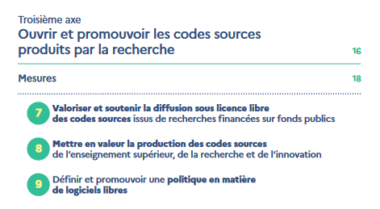
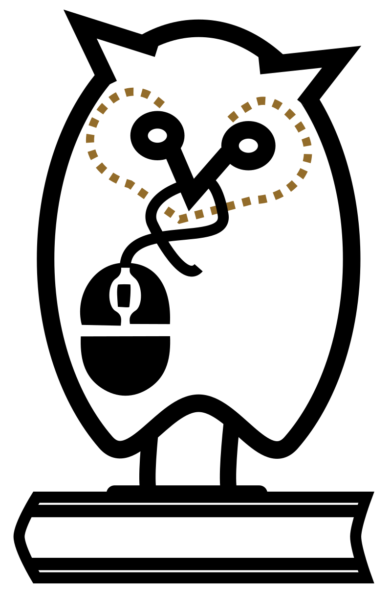
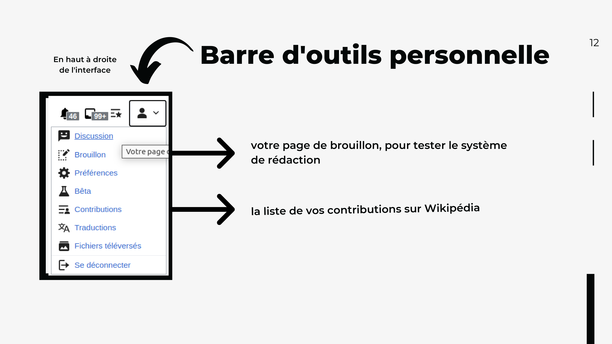
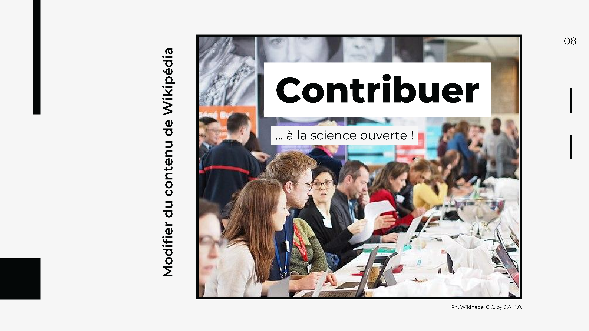
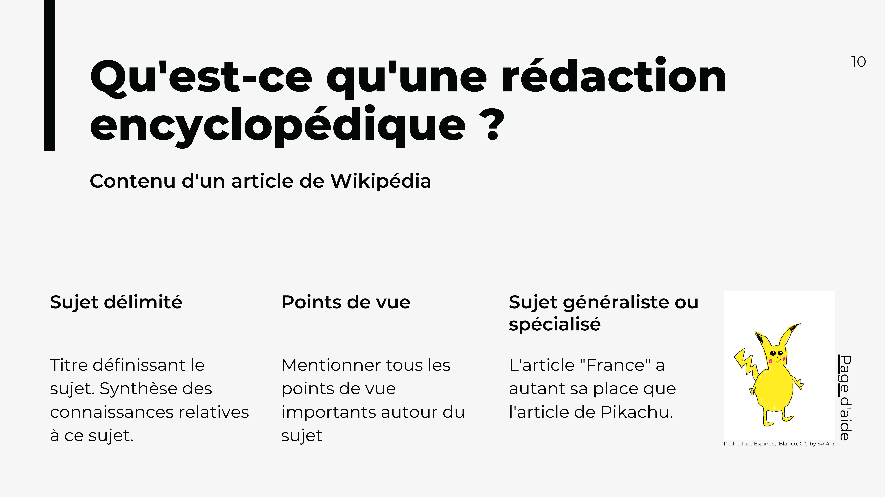
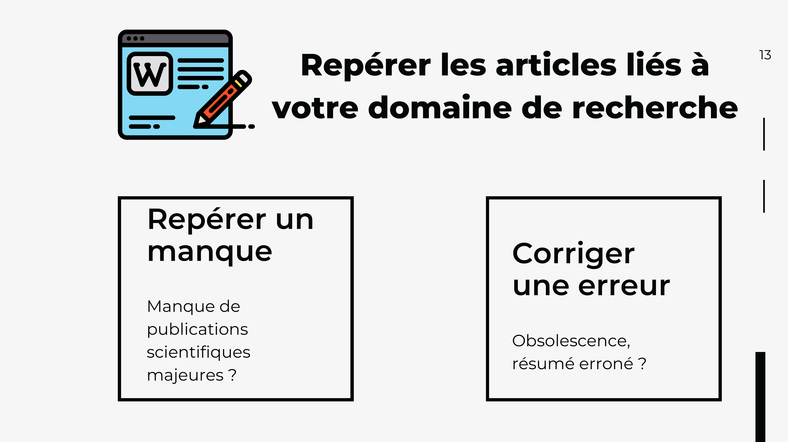
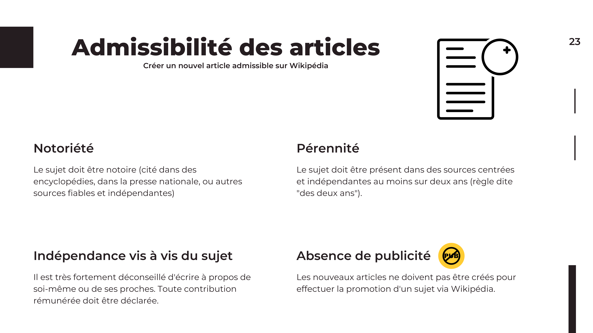
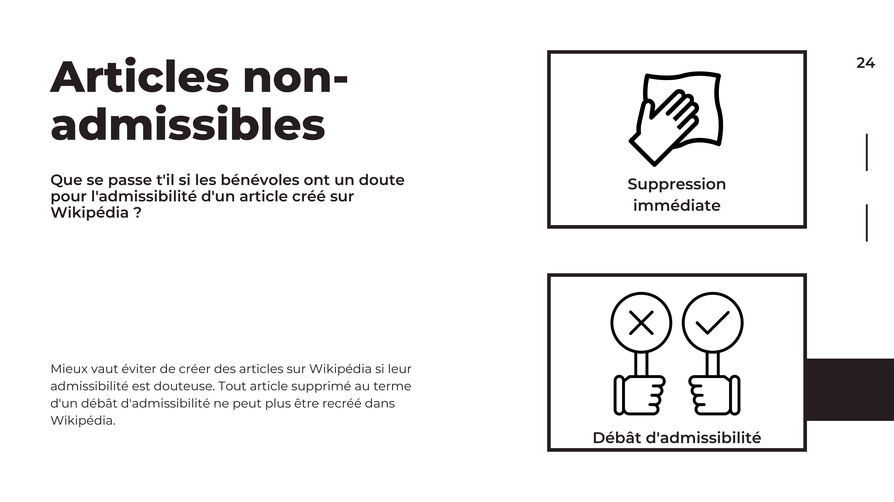

<!-- Scoped style -->

## Atelier d'Initiation à Wikipédia
Contribuer à Wikipédia, parler de Wikipédia.
<small>
[Hugo Lopez](https://fr.wikipedia.org/wiki/User:Hugo_en_résidence)
Wikimédien en résidence
hugo.lopez@univ-toulouse.fr
</small>

---
# Plan
1. Installation
2. Contexte de formation
3. Wikipédia
4. Éditer Wikipédia
5. Q&A

---
# Contexte de formation
<!-- 09:35 -->
- Formateur : 20 ans de Wiki !
- Formation : science et science ouverte, bibliothécaires et commun numériques libres (Wikipédia)
- Logistique: une pause, questions, etc.

---
<!-- 09:38 -->
### Science ouverte

---
<!-- ### Portion d'articles ouverts -->
 
-> Documentalistes et bibliothécaires en tête !

---
<!-- 4 axes science ouverte -->

  
 

--- 
### Université de Toulouse et Culture Libre

- nos valeurs et missions historiques
- les pratiques des communs numériques collaboratifs

--- 
### Campagne #1lib1ref

- "Un bibliothécaire, une référence." (One libarian, one reference.)
- Campagne semestrielle d'initiation et de contribution
- Du 15 janvier au 15 février et 15 mai au 15 juin.

---
### Quelques questions

---
#### Vos usages
<!-- 10:00 : Quantitatif -->
* A) Combien d'articles wikipédia consultés par semaine : 
  <10 ?
  <100 ?
  <1000 ?
* B) Qui a déjà édité ?

---
#### Vos représentations
<!-- 10:02 : Qualitatif -->
Fiabilité: Sur Wikipédia, les erreurs et biais sont
- A) fréquents
- B) occasionels
- C) rares
<!-- 
Discussion: 
- Quelle wikipédia, quels articles, quand ?
- Humilité de Wikipédia
-->

---
<!-- 10:0: ### Table d'évaluation -->

---
### Pourquoi éditer Wikipédia ?
<!-- 10:06 -->

• Bibliothécaires
• Vos publics

---
<!-- 10:20 Motivation 

 

--- -->

---
<!-- 10:17  -->
# Wikipédia...
• Quelques éléments fondamentaux...

---
<!-- En chiffres -->

---
<!-- 10:20 Principes -->

<!-- 
10:23 Licence libre -- >

-- >

---
< !-- Licence libre : échèle 
 -->

---
<!-- Licence libre : échèle -->

---
<!-- 10:25 -->
### Création de compte

---
<!-- ### Création de compte -->

---
<!-- Menu personnel -->

---
### Test : Créez-vous un brouillon !

---
<!-- 10:40 -->
### Pause café (1)

---
<!-- 11:00 -->
# Éditer Wikipédia
### #1lib1ref
<!--
 
-->

--- 
### Comment participer #1lib1ref
1. Trouver un article nécessitant une référence
2. Trouver une source de qualité pour y répondre
3. Ajouter la référence
4. Dans le commentaire de modification, ajouter #1lib1ref

---
<!-- 11:00 Barre Editeur visuel -->

---
<!-- 11:05 Modifier un article-->

---
<!-- 11:10 Sourcer  -->

<!---
• Être capable d'éditer un texte multi-média sur Wikipédia > L'interface d'édition
• Se créer une page brouillon > Edition d'un brouillon personnel
• Être capable d'éditer un texte scientifique sur Wikipédia > L'interface d'édition avancée, Édition d'un brouillon personnel avec formules
• Être capable d'éditer Wikipédia et ses modèles en copiant d'une autre page > Éditer un brouillons personnel avec modèle
-->

---
<!-- ### Périmètre -->

---
<!-- Repérages -->

---
<!-- Admissibilité -->

---
<!-- Admissibilité -->

<!-- 
---
## Pause café (2)
<!-- 15:00 -->

---
# Interagir sur Wikipédia

---
<!-- Debatre -->

<!-- :00 --
---
Savoir interagir avec la communauté sur Wikipédia
• En cas de doute, chercher de l'aide, apprendre > Citer les lieux d'aide aux nouveaux.
• Cartographier lieux de discussion > Citer les lieux de discussion
• Cartographier les types d'interlocuteurs > Analyser l'historique ? Bestiaire ?
• Cartographier les roles (logiciels) sur Wikipédia > Citer les aidants et connaissants
-->
---
# Pour aller plus loin

Métriques d'articles : Gascon
- [Page statistics](https://xtools.wmflabs.org/articleinfo/en.wikipedia.org/Gascon_dialect)
- [Pageviews](https://pageviews.wmcloud.org/?project=en.wikipedia.org&platform=all-access&agent=user&redirects=0&range=this-year&pages=Gascon_dialect)

Permet d'identifier les connaissants bénévoles.

---

---
## Restons en contact

URFIST Occitanie
 <a href="https://fr.wikipedia.org/wiki/user:Hugo_en_résidence">Utilisateur:Hugo en résidence</a>
 Formateur aux communs numériques ouverts
 Parainage pour l'édition sur Wikipédia

---
## Restons en contact

[Projet:Wikifier la science/Infolettre](https://fr.wikipedia.org/wiki/Projet:Wikifier_la_science/Infolettre)

---
## Restons en contact
| URFIST | Wikimedien en résidence
| ---- | ---- |
| Bretagne+ | <a href="https://fr.wikipedia.org/wiki/user_talk:Juliette_en_résidence">Utilisateur:Juliette en résidence</a>
| Bordeaux | <a href="https://fr.wikipedia.org/wiki/user_talk:Pyb_en_résidence">Utilisateur:Pyb en résidence</a>
| Occitanie | <a href="https://fr.wikipedia.org/wiki/user_talk:Hugo_en_résidence">Utilisateur:Hugo en résidence</a>

Formateurs aux numériques libres de Wikimédia

---
#### Remerciements

Tous les contenus textuels sont sous licence libre.
Crédit: Hugo Lopez, Amélie Charles CC-BY-SA 4.0.
Les illustrations sont la propriété de leurs auteurs respectifs.

<!-- 15:00 -->
