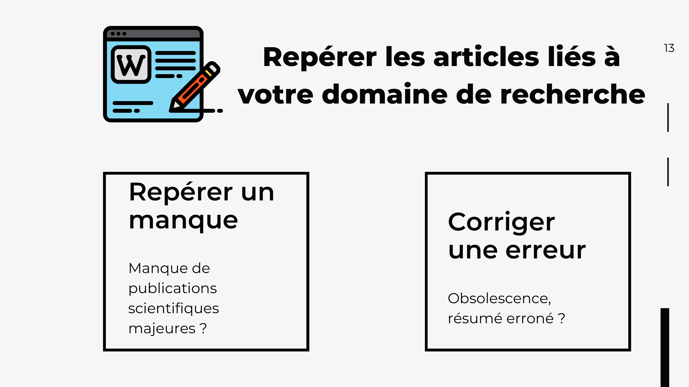

<!-- Scoped style -->

## Atelier d'Initiation à Wikipédia
Contribuer à Wikipédia, #WIKIF 2023.
<small>
[Hugo Lopez](https://fr.wikipedia.org/wiki/User:Hugo_en_résidence)
Wikimédien en résidence
hugo.lopez@univ-toulouse.fr
</small>

---
# Plan
1. Installation
2. Contexte science ouverte et contexte local
3. Introduction à Wikipédia
3. Éditer Wikipédia
6. Interagir sur Wikipédia
7. Pour aller plus loin

---
<small>

### Objectifs
<!-- 09:35 : SLIDE 44 -->
- rappels sur le mouvement Science ouverte et Wikipédia
- être capable d'ajouter une source sur Wikipédia
- être capable d'ajouter paragraphe, section ou article sur Wikipédia
- (rajouter une resource en lien avec WIKIF à Wikipédia.)
</small>

---
# Contexte
<!-- 09:35 -->
- Formateur : 20 ans de Wiki !
- Formation : science et science ouverte, commun numériques libres (Wikipédia)
- Participants: vrai débutants à confirmés ; univsersitaires 
- Format: circulation libre, questions libres.

---
# Tour de table
<!-- 09:40 -->
[Optionel]
- 30 secs / personnes
- Nom, service, missions, affinité avec SO, CC, Wikis ?

---
<!-- 09:38 -->
### Science ouverte

---
<!-- ### Portion d'articles ouverts -->
 
-> Documentalistes et bibliothécaires en tête !

---
<!-- 4 axes science ouverte -->

  
 

--- 
### Université de Toulouse et Culture Libre

- nos valeurs et missions historiques
- les pratiques des communs numériques collaboratifs

--- 
### WIKIF

- WIKIF : Wikipédia et les femmes scientifiques
- [Wikipédia:Rencontres/Toulouse/Initiation_à_Wikipédia](https://fr.wikipedia.org/wiki/Wikip%C3%A9dia:Rencontres/Toulouse/Initiation_%C3%A0_Wikip%C3%A9dia)

---
### Quelques questions

---
#### Vos usages
<!-- 10:00 : Quantitatif -->
* A) Combien d'articles wikipédia consultés par semaine : 
  <10 ?
  <100 ?
  <1000 ?
* B) Qui a déjà édité ?
* C) Qui a lu une page de discussion
* D) Qui à discuté ?

---
#### Vos représentations
<!-- 10:02 : Qualitatif -->
Fiabilité: Sur Wikipédia, les erreurs et biais sont
- A) fréquents
- B) occasionels
- C) rares
<!-- 
Discussion: 
- Quelle wikipédia, quels articles, quand ?
- Humilité de Wikipédia
-->

---
<!-- 10:0: ### Table d'évaluation -->

 
--- 

---
<!-- 10:17  -->
# Wikipédia...
• Quelques éléments fondamentaux...

---
<!-- En chiffres -->

---
<!-- 10:20 Principes -->

<!-- 
10:23 Licence libre -- >

-- >

---
< !-- Licence libre : échèle 
 -->

---
<!-- Licence libre : échèle -->

---
<!-- 10:25 -->
### Création de compte

---
<!-- ### Création de compte -->

---
<!-- Menu personnel -->

---
### Test : Créez-vous un brouillon !

---
<!-- 11:00 -->
# Éditer Wikipédia
### WIKIF
<!--
 
-->

--- 
### Comment participer l'atelier #WIKIF
1. Trouver une source de qualité sur une femmes de science
2. Trouver son article associé ou créer un bouillon
3. Ajouter l'information manquante et sa référence
4. Dans le commentaire de modification, ajouter #WIKIF

<!-- ---
 11:00 Citation Hunt
### Citation Hunt

- Utiliser https://citationhung.toolforge.org/fr

-->

---
<!-- 11:00 Barre Editeur visuel -->

---
<!-- 11:10 Sourcer  -->

<!---
• Être capable d'éditer un texte multi-média sur Wikipédia > L'interface d'édition
• Se créer une page brouillon > Edition d'un brouillon personnel
• Être capable d'éditer un texte scientifique sur Wikipédia > L'interface d'édition avancée, Édition d'un brouillon personnel avec formules
• Être capable d'éditer Wikipédia et ses modèles en copiant d'une autre page > Éditer un brouillons personnel avec modèle
-->

---
<!-- Repérages -->

---
### Rappels

---
<!-- ### Périmètre -->

---
<!-- Admissibilité -->

---
<!-- Admissibilité -->

<!-- 
---
## Pause café (2)
<!-- 15:00 -->

---
# Interagir sur Wikipédia

---
<!-- Debatre -->

<!-- :00 --
---
Savoir interagir avec la communauté sur Wikipédia
• En cas de doute, chercher de l'aide, apprendre > Citer les lieux d'aide aux nouveaux.
• Cartographier lieux de discussion > Citer les lieux de discussion
• Cartographier les types d'interlocuteurs > Analyser l'historique ? Bestiaire ?
• Cartographier les roles (logiciels) sur Wikipédia > Citer les aidants et connaissants
-->
---
# Pour aller plus loin

Métriques d'articles : **Marie Curie**
- [Page statistics](https://xtools.wmflabs.org/articleinfo/fr.wikipedia.org/Marie_Curie)
- [Pageviews](https://pageviews.wmcloud.org/?project=fr.wikipedia.org&platform=all-access&agent=user&redirects=0&range=this-year&pages=Marie_Curie)

Permet d'identifier les bénévoles-expert.e.s.

---

---
## Restons en contact

URFIST Occitanie
 <a href="https://fr.wikipedia.org/wiki/user:Hugo_en_résidence">Utilisateur:Hugo en résidence</a>
 Formateur aux communs numériques ouverts
 Parainage pour l'édition sur Wikipédia

---
## Restons en contact

[Projet:Wikifier la science/Infolettre](https://fr.wikipedia.org/wiki/Projet:Wikifier_la_science/Infolettre)

---
## Restons en contact
| URFIST | Wikimedien en résidence
| ---- | ---- |
| Bretagne+ | <a href="https://fr.wikipedia.org/wiki/user_talk:Juliette_en_résidence">Utilisateur:Juliette en résidence</a>
| Bordeaux | <a href="https://fr.wikipedia.org/wiki/user_talk:Pyb_en_résidence">Utilisateur:Pyb en résidence</a>
| Occitanie | <a href="https://fr.wikipedia.org/wiki/user_talk:Hugo_en_résidence">Utilisateur:Hugo en résidence</a>

Formateurs aux numériques libres de Wikimédia

---
#### Remerciements

Tous les contenus textuels sont sous licence libre.
Crédit: Hugo Lopez, Amélie Charles CC-BY-SA 4.0.
Les illustrations sont la propriété de leurs auteurs respectifs.

<!-- 15:00 -->
