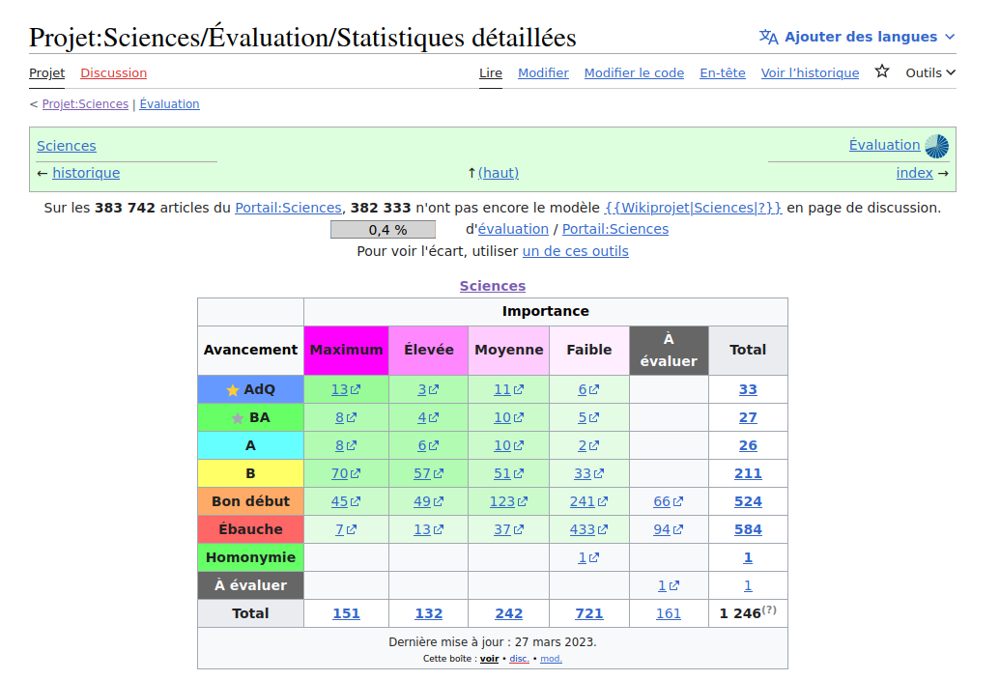
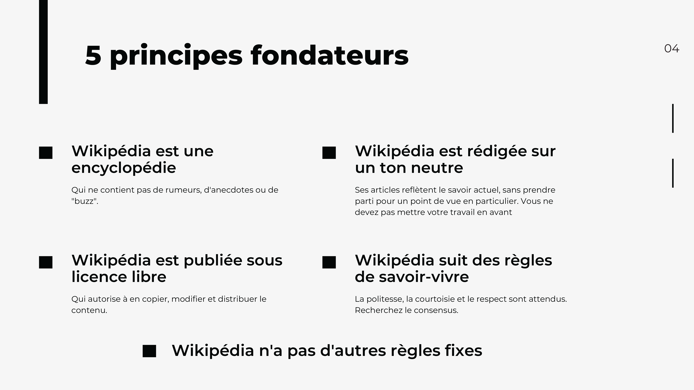
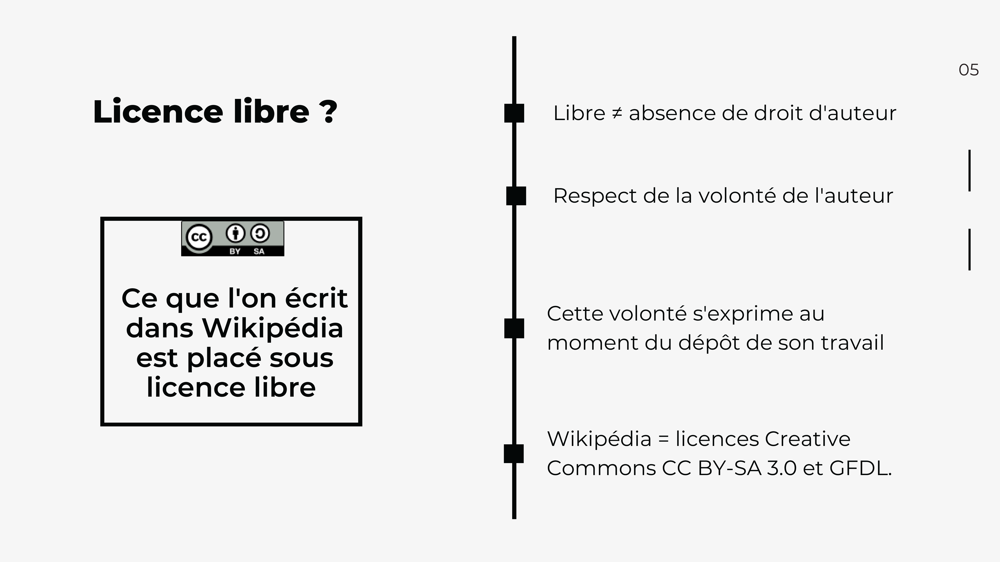
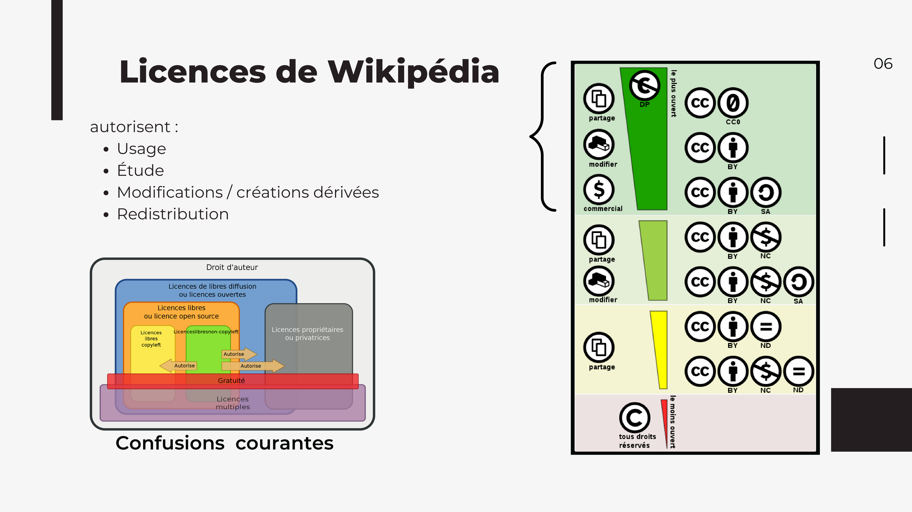
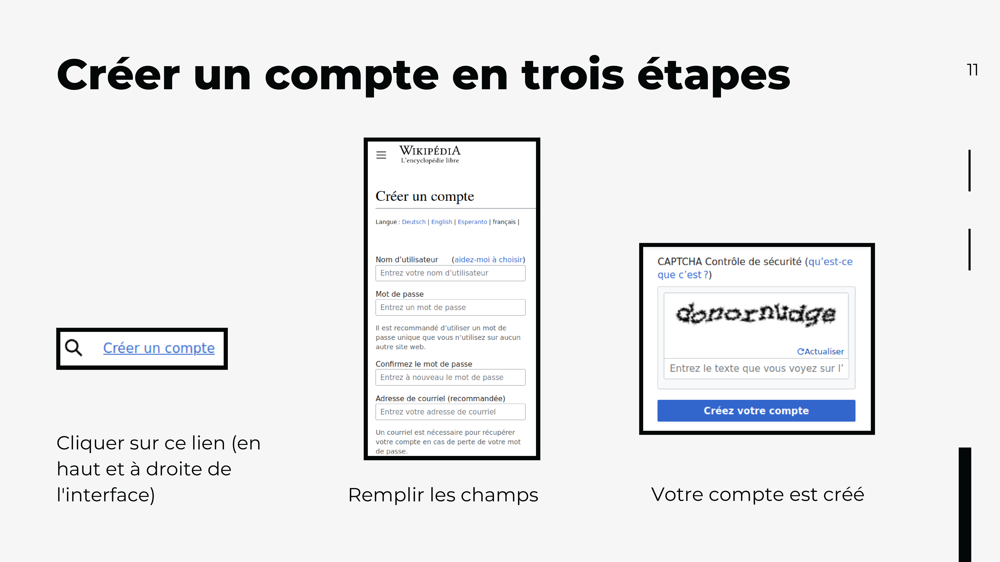
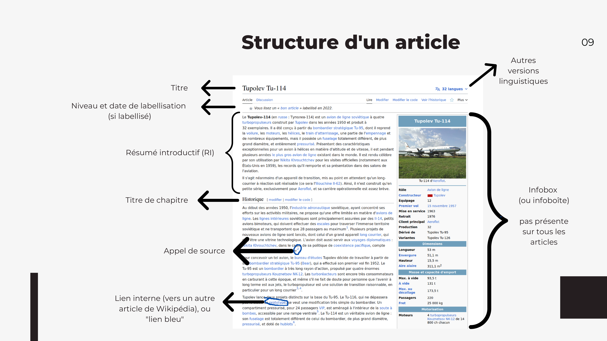
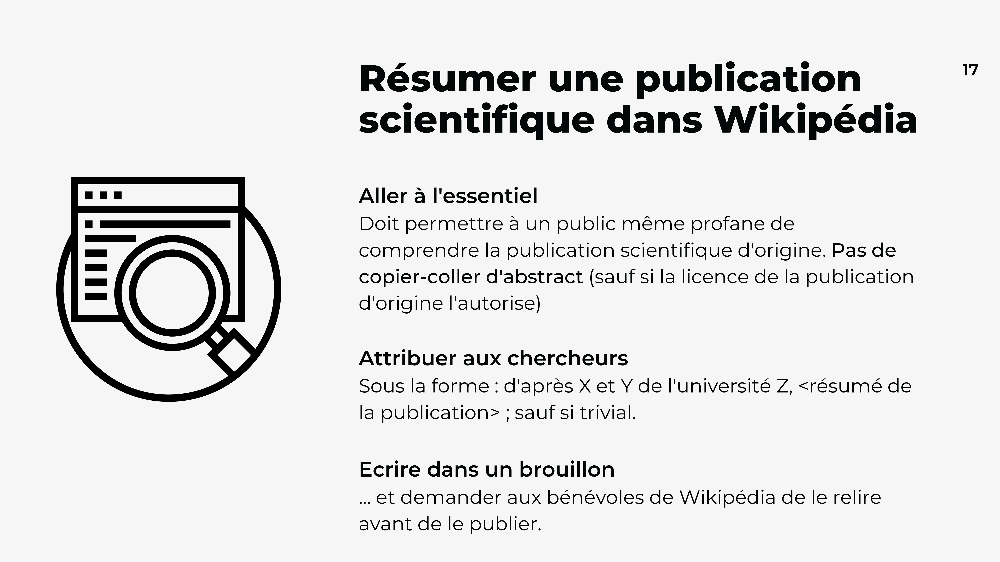
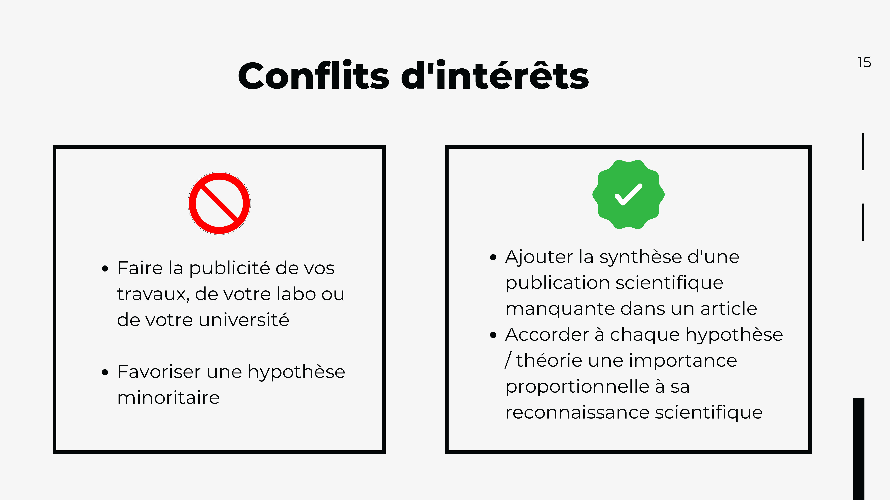

<!-- Scoped style -->

## Transformer des publications scientifiques en articles Wikipédia

Atelier de formation à Wikipédia  afin d'y valoriser ses recherches, notes ou publications.
 
<small><small>Hugo Lopez - Wikimédien en résidence. https://notes.wikimedia.fr/p/UT</small></small>

---
# Plan
1. Installation et discussion socle
2. Wikipédia
3. Éditer Wikipédia
4. Questions de style
5. Adapter mes recherches à Wikipédia
6. Interagir sur Wikipédia
7. Pour aller plus loin

---
# Contexte de formation
<!-- 09:40 -->
- Formateur
- Formation : Sciences - Science Ouverte - Wikipédia
- Logistique: pauses, code de conduite.

---

---
<!-- ### Portion d'articles ouvers -->
  

---
<!-- 4 axes science ouverte -->

  
 

---
<small>

### Objectifs
<!-- 09:40 : SLIDE 44 -->
En fin de formation, l'apprenant saura:
- identifier les enjeux "science, science ouverte, Wikipédia"
- identifier, parmis ses recherches, les contenus valorisables sur Wikipédia
- reformuler ses contenus de recherches en contenus encyclopédiques sourcés
- ajouter un paragraphe, section, article sourcé sur Wikipédia
</small>

---
### Tour de table
<!-- 09:50 -->
• 1 minute x 10 -> 10 mins

---
### Quelques questions

---
#### Vos usages
<!-- 10:00 : Quantitatif -->
- A) Combien d'articles ouverts / semaine : 
  <10 ?
  <100 ?
  <1000 ?
- B) Qui a édité ?
- C) Qui a lu une page de discussion
- D) Qui à discuté ?

---
#### Vos représentations
<!-- 10:02 : Qualitatif -->
Fiabilité: Sur Wikipédia, les erreurs et biais sont
- A) fréquents
- B) occasionels
- C) rares
- D) jamais vu, je ne lis que des articles académiques
<!-- 
Discussion: 
- Quelle wikipédia, quels articles, quand ?
- Humilité de Wikipédia
-->

---
<!-- 10:0: ### Table d'évaluation -->

---
#### Pourquoi éditer Wikipédia ?
<!-- 10:06 -->

• Pros: Quelles motivations ?
• Cons: Quels freins ?
<!-- 
Lister:
- 3mins + 3mns
- ses motivations 
- ses freins 
- échanger avec ses pairs ?
Feedback: relativiser.
-->

---
<!-- 10:20 Motivation -->

---

---
<!-- 10:15 : Quantitatif -->
#### Jusqu'où éditer Wikipédia ?
• A) Ajouter quelques références
• B) Partager quelques notes, corriger l'existant
• C) Move out ! J'ai 35 pages de notes sourcées sur le [geckos de Sumatra](https://en.wikipedia.org/wiki/Cyrtodactylus_santana) ! Où dois-je coller ça !? Ò_Ó

---
<!-- 10:17  -->
# Wikipédia...
• Quelques éléments fondamentaux...

---
<!-- En chiffres -->

---
<!-- 10:20 Principes -->

<!-- 
10:23 Licence libre -- >

-->

---
<!-- Licence libre : échèle -->

---
<!-- Licence libre : échèle -->

---
<!-- 10:25 -->
### Création de compte

---
<!-- ### Création de compte -->

---
<!-- Menu personnel -->

---
### Test : Créez-vous un brouillon !

---
<!-- 10:40 -->
### Pause café (1)

---
<!-- 11:00 -->
# Éditer Wikipédia
<!--
 
-->

---
<!-- 11:00 Barre Editeur visuel -->

---
<!-- 11:05 Modifier un article-->

---
<!-- 11:10 Sourcer  -->

<!---
• Être capable d'éditer un texte multi-média sur Wikipédia > L'interface d'édition
• Se créer une page brouillon > Edition d'un brouillon personnel
• Être capable d'éditer un texte scientifique sur Wikipédia > L'interface d'édition avancée, Édition d'un brouillon personnel avec formules
• Être capable d'éditer Wikipédia et ses modèles en copiant d'une autre page > Éditer un brouillons personnel avec modèle
-->
---
<!-- 11:15 Sourcer  -->
# Questions de styles
- Analyser la structure et le style des articles encyclopédiques
- Comparer à vos ressources académiques
- Quels recoupements ?

---
<!-- ### Périmètre -->

---
<!-- ### Structure d'un article Wikipédia -->

---
<!-- ### Structure d'un article Wikipédia -->

---
### Examinez quelques articles !
Modalité : individuellement mais en discutant.
Questions : 
- Quelles structures ? 
- Quels styles ?

<!---
• Distinguer les sections typiques d'un article encyclopédique de mon champs > Analyse d'articles Wikipédia
• Distinguer les sections typiques des articles académiques de mon champs > Analyse d'articles académiques
• Comparer et lier les recouvrements
• Identifier dans mes recherches les sections "portables" vers Wikipédia
• Discuter du style rédactionel des articles Wikipédia > Discuter avec collègue.
-->

---
# Adapter des recherches à Wikipédia
• Se créer une page brouillon
• Ajouter une de vos lectures ou recherches sur Wikipédia
• Adapter un texte académique en fiche encyclopédique sur Wikipédia

---
<!-- Repérages -->

---
<!-- Admissibilité -->

---
<!-- Admissibilité -->

---
<!-- Résumer une publication scientifique -->

---
<!-- Conflit d'interets -->

<!-- 
---
## Pause café (2)
<!-- 15:00 -->

---
# Interagir sur Wikipédia

---
<!-- Debatre -->

<!-- :00 --
---
Savoir interagir avec la communauté sur Wikipédia
• En cas de doute, chercher de l'aide, apprendre > Citer les lieux d'aide aux nouveaux.
• Cartographier lieux de discussion > Citer les lieux de discussion
• Cartographier les types d'interlocuteurs > Analyser l'historique ? Bestiaire ?
• Cartographier les roles (logiciels) sur Wikipédia > Citer les aidants et connaissants
-->
---
# Pour aller plus loin

Métriques d'articles : Gascon
- [Page statistics](https://xtools.wmflabs.org/articleinfo/en.wikipedia.org/Gascon_dialect)
- [Pageviews](https://pageviews.wmcloud.org/?project=en.wikipedia.org&platform=all-access&agent=user&redirects=0&range=this-year&pages=Gascon_dialect)

Permet d'identifier les connaissants bénévoles.

---

---
## Restons en contact

URFIST Occitanie
 <a href="https://fr.wikipedia.org/wiki/user:Hugo_en_résidence">Utilisateur:Hugo en résidence</a>
 Formateur aux communs numériques ouverts
 Aide à la finalisation de sections ou articles sur WP

---
#### Remerciements

Tous les contenus textuels sont sous licence libre.
Crédit: Hugo Lopez, Amélie Charles CC-BY-SA 4.0.
Les illustrations sont la propriété de leurs auteurs respectifs.

<!-- 15:00 -- >

---
# TODO MRV
- [x] Pad :
- Timing
- Dashboard 
- Wikipage : [[User:Hugo en résidence/UT]] /PHD
- Copier style du HDD
- Visiter la salle, mettre des feuille par groupe

- Print

--> 
