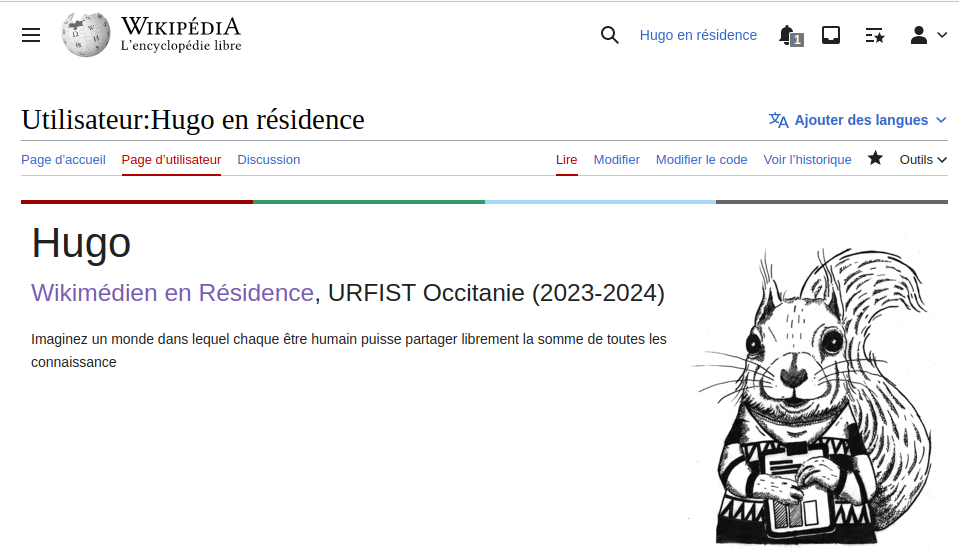

<!-- Scoped style -->

# Initiation à Wikipédia

Enrichir, mettre à jour Wikipédia.  
 
<small><small>Juliette Halimi - Pierre Yves Beaudouin - Hugo Lopez Wikimédiens en résidence. </small></small>

---
# Plan
1. Questions
2. Wikipédia express !
3. Éditer Wikipédia
7. Pour aller plus loin

---
<small>

### Objectifs
<!-- 09:35 : SLIDE 44 -->
En fin de formation, l'apprenant:
- aura un compte Wikipédia !
- sera capable d'ajouter une source à Wikipédia
- sera capable de mettre à jour un article liée à ses actions
</small>

---
# Quelques questions

---
#### Vos usages
<!-- 10:00 : Quantitatif -->
* A) Combien d'articles wikipédia consultés par semaine : 
  <10 ?
  <100 ?
  <1000 ?
* B) Qui a déjà édité ?
* C) Qui a lu une page de discussion
* D) Qui à discuté ?

---
#### Vos représentations
<!-- 10:02 : Qualitatif -->
Fiabilité: Sur Wikipédia, les erreurs et biais sont
- A) fréquents
- B) occasionels
- C) rares

---
<!-- 10:0: ### Table d'évaluation -->

---
<!-- 10:17  -->
# Wikipédia...
• Quelques éléments fondamentaux...

---
<!-- En chiffres -->

---
<!-- Licence libre : échèle -->

---
<!-- 10:25 -->
# Éditer WikipÉdia
### 1. Création de compte
- [Special:Login](https://fr.wikipedia.org/wiki/Special:CreateAccount)

---
<!-- ### Création de compte -->

---

---
<!-- Menu personnel -->

---
### 2. Créez-vous un brouillon !

---
<!-- 11:00 Barre Editeur visuel -->

---
<!-- 11:10 Sourcer  -->
### 3. Ajouter une source

---

---
# Pour aller plus loin

Métriques par article : [URFIST](https://fr.wikipedia.org/wiki/URFIST)
- [Page statistics](https://xtools.wmcloud.org/articleinfo/fr.wikipedia.org/Unité_régionale_de_formation_à_l'information_scientifique_et_technique)
- [Pageviews](https://pageviews.wmcloud.org/?project=en.wikipedia.org&platform=all-access&agent=user&redirects=0&range=this-year&pages=Unité_régionale_de_formation_à_l'information_scientifique_et_technique)

Permet d'identifier les éditeurs actifs.

---
## Restons en contact

[Projet:Wikifier la science/Infolettre](https://fr.wikipedia.org/wiki/Projet:Wikifier_la_science/Infolettre)

---
## Restons en contact
| URFIST | Wikimedien en résidence
| ---- | ---- |
| Bretagne+ | <a href="https://fr.wikipedia.org/wiki/user_talk:Juliette_en_résidence">Utilisateur:Juliette en résidence</a>
| Bordeaux | <a href="https://fr.wikipedia.org/wiki/user_talk:Pyb_en_résidence">Utilisateur:Pyb en résidence</a>
| Occitanie | <a href="https://fr.wikipedia.org/wiki/user_talk:Hugo_en_résidence">Utilisateur:Hugo en résidence</a>

Formateurs aux numériques libres de Wikimédia

---
#### Remerciements

Tous les contenus textuels sont sous licence libre.
Crédit: Hugo Lopez, Amélie Charles CC-BY-SA 4.0.
Les illustrations sont la propriété de leurs auteurs respectifs.
