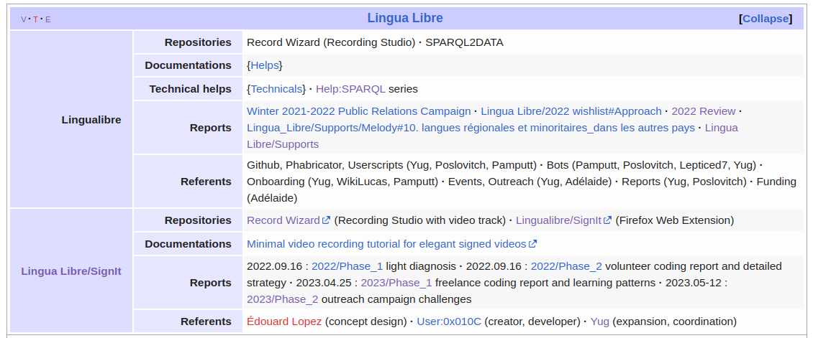

<!-- Scoped style -->

# 語音詞典
## Recording voices and local languages with Lingualibre

[Hugo Lopez](https://fr.wikipedia.org/wiki/User:Yug)
hugo.lopez@univ-toulouse.fr

---
### Hugo Lopez
- Elearning and language professional
- Open education resources
- Wikimédian in University
* Occitan, not French.

---
### Outline

- Language diversity
- LinguaLibre & objectives
- Demo of the tool (10mins)
- Current progresses, limits & biases
- Q&A

---
# Languages diversity

---
 

<!--
- 7000 Languages, half will die out this century
- Languages are often segregated, politized
- Case of France, Taiwan, India

-->

---
### Languages diversity : dimensions

Document languages diversity and voices.

- Languages
- Accents
- Voices
- Genders

---
### Languages diversity : objectives
> The diversity of our languages, their words, expressions, voices, are poorly documented and accessible. We want to record, share and make visible those expressions at large scale, in an easy and quick fashion (800 audio/hour).

---
# Lingualibre

---
### What is Lingua Libre
The case of Alsacian !

- Wikimedia's open source recording tool
- …to document Alsacian
- For language e-learning services

---
### Oral languages' learning chain
| Learners | ← | Speakers
|-----|----|-----|
| e-services |  Data | Lingualibre Studio |
|  |  |  |
| **Learning** | Audio & text | Sharing

---
# Demonstration (10mins)

---
### Lingua Libre: audio recording studio

 

Page: [Lingualibre.org Recording Studio](https://Lingualibre.org/wiki/Special:RecordWizard)

---
### Lingua Libre: Apps

 

List: [Lingua Libre Apps](https://lingualibre.org/wiki/LinguaLibre:Apps). Future: [Moedict.tw](https://www.moedict.tw) ?

---
# Progresses, limits & biases
After 5 year and 900,000+ recordings, we would like to share past progresses, current analysis and future actions.

---
### Languages typology & specifics
| Large | Medium | Minorities
|---|---|---|
| Resourced | Low resources | Written ?
|  |  |   

---
### Languages typology & specifics
| Large | Medium | Minorities
|---|---|---|
| Resourced | Low resources | Written ?
|  |  | 

---
### In numbers

| Production | Contributors
|---|---|
| [Languages gallery](https://lingualibre.org/LanguagesGallery/) | [Lingua Libre map](https://meta.wikimedia.org/wiki/Lingua_Libre)
|  | 

---
### In numbers

| Production | Reuses 
|---|---|
| [Languages gallery](https://lingualibre.org/LanguagesGallery/) | [2022 review](https://meta.wikimedia.org/wiki/Lingua_Libre/2022_Review#Distribution_of_recordings_publications)
|  | 

---
### Qualitative

- Per language: large vs minorities
- Per gender
- Per age
- Per per area, income, etc.

---
### Languages typology coverage

---
### Key needs
- Mobile **e-dictionaries** for local communities
- For **revitalisation** ! Not documentation.
- Outreach to 6,500 local communities ?

---
### Wikimedia Movement
Best global network to support languages diversity

---
### Q&A

---
## Keep in touch
| Role | Contacts
|:---- |:---- |
| Lead, dev | <a href="https://fr.wikipedia.org/wiki/user_talk:Yug">User:Yug</a>
| Wikimedia France | <a href="https://fr.wikipedia.org/wiki/user_talk:Juliette_en_résidence">User:Adélaïde Calais WMFr</a>
| Home | [Lingualibre.org](https://lingualibre.org)
| Code | [github.com/lingua-libre](https://github.com/lingua-libre)

---
# Thank !

---

### Credits
The following Wikimedia Commons images have been used:
| File  |  Licence | Author
|:----|:----|:---
File:Human_Language_Families.png | CC-BY-SA | JFDP13
File:WikiLucas00_à_l'Institut_international_pour_la_Francophonie.jpg | CC-BY-SA | WikiLucas00
File:Daramlagon_and_Maerui-sama_session_on_Bikol_Wiktionary_and_Lingua_Libre_03.jpg | CC-BY-SA | Daramlagon
File:LinguaLibre_2022_Paris_Surui_training-03.jpg | CC-BY-SA | Yug
File:Forom_des_langues,_Toulouse,_2023-01.jpg | CC-BY-SA | Yug
|File:éance_Lingua_Libre_à_Cotonou_en_Mars_2021_-_Photo_17.jpg | CC-BY-SA | Fawaz.tairou
File:Lingua_Libre_Atikamekw_at_Wikimania_2017_Montreal.jpg | CC-BY-SA | Benoit Rochon

<!-- 15:00 -->

