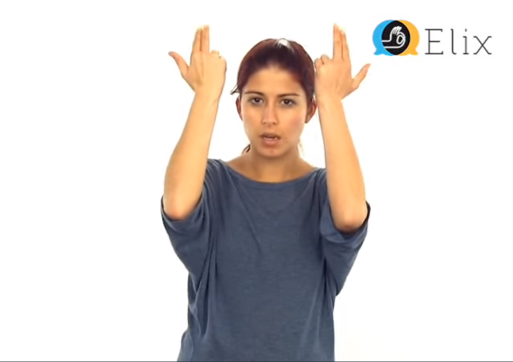
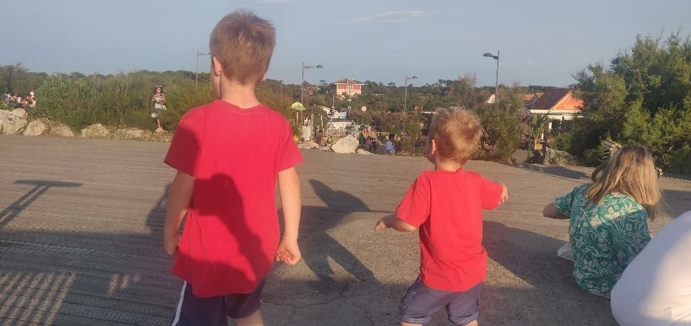
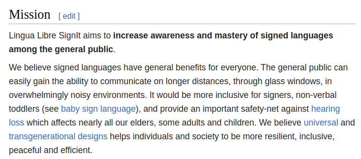
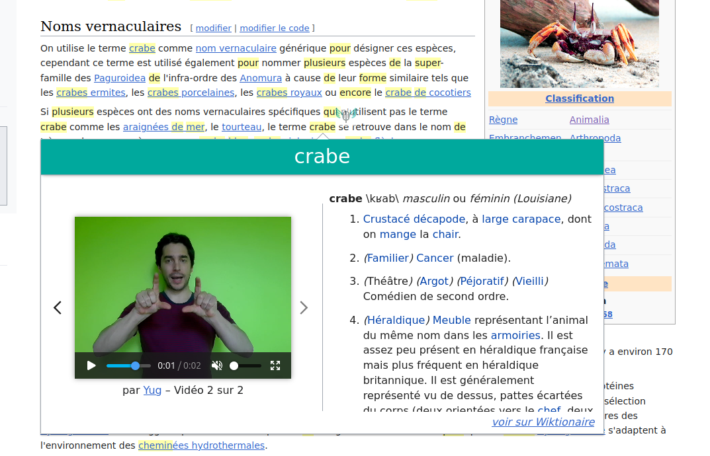
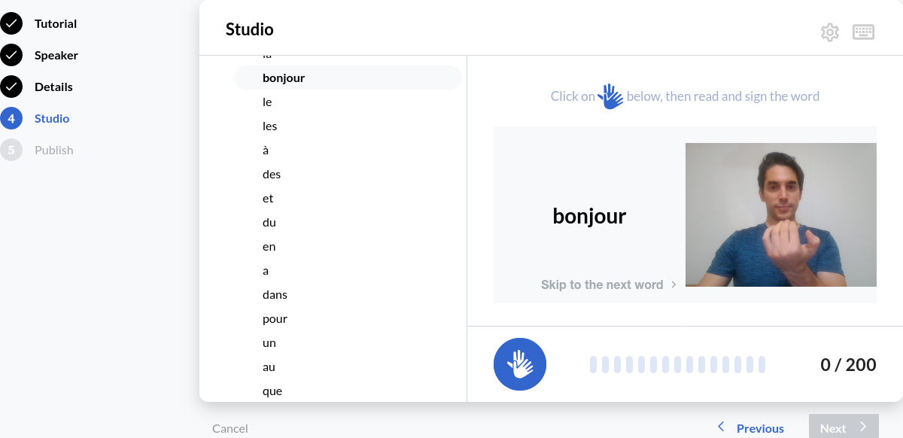

<!-- Scoped style -->

# 手語詞典

#### Sign Languages of the world : increase mutual understanding
with Lingualibre SignIt.

[Hugo Lopez](https://fr.wikipedia.org/wiki/User:Yug)
hugo.lopez@univ-toulouse.fr

---

 

---
### Toddlers

* Again * Stop * Rabbit * Crab * Fish |

---
### Hugo Lopez
- Elearning and language professional
- Open education resources
- Teach new technologies to PhD
* 100% left-ear deafness

---
### Elders
* 10 mins

---
### Daily life
* 

---
# Outline
- Cases
- Vision
- Proposition

---

# Communication and Sign Languages

---

### Ways we communicate ?

* In library, we *whisper*
- At work, we *speak*
* At parties, we *scream* 
* Sometimes, we ***sign***

 

* **We use what allows us to communicate.**

---
### Where sign languages would help ?

Where do we use sign languages ?
* on the road
* in noisy pubs
* when we doubt
* with foreign speakers
* when across a street
* with babies, toddlers
* with elders

---
<!-- Scoped style -->
### Where sign languages would help ?

> *Whereas Sign Languages are perceived as primarily for deaf people, all of us at different stages of our lives, would gain from basic mastery of sign languages*

If useful for everyone, but not in widespread use...
... How to we support sign languages ?

---
# LinguaLibre SignIt

---
<!-- Scoped style -->

### Our vision and values

---
### Challenge we take on
> Provide **scalable e-learning service** in **various languages pairs**, as **open educational resources** content and in a **professional** fashion.

But where to start ? ; )

---
### Sign languages' learning chain

| Learners | ← | Signers
|-----|----|-----|
| SignIt extension |  Data | Lingualibre Studio |
|  |  |  |
| **Learning** | Video & text | Sharing

---
### Lingua Libre SignIt: Firefox extension

 

Demo: [Lingua Libre SignIt Firefox addons](https://addons.mozilla.org/en-US/firefox/addon/lingua-libre-signit/)

---
### Lingua Libre: video recording studio

 

Demo: [Lingualibre.org Recording Studio](https://Lingualibre.org/wiki/Special:RecordWizard)

---
### Value-added asked by our users

- Begginers: **general public** wants o learn basic signs via a **begginer dictionary**
- Experts: **signers** & **translators** to check an **advanced dictionary**
- Both: create **learning lists**

---
### Limits
- Prototype: only FSL+French, 700+ videos
- Dictionaries are difficults (polysemy, etc)
- Need contributors
- Need developpers
- Need to be better known

---
### Strengh
- 300 videos / hour !
- Open content
- "We have to"

---
# How to support ?

1- Support Sign Language learning whenever you can !

2- Speak about us to :
- local deaf communities
- open source web developers

---
# Q&A

---
# Keep in touch
| Role | Entry point
|:----|:----|
| Lead dev | Hugo Lopez / [User:Yug](https://meta.wikimedia.org/wiki/user_talk:Yug)
| Recording studio | [Lingualibre.org](https://lingualibre.org/wiki/Special:RecordWizard)
| Firefox extension | [Lingualibre SignIt](https://addons.mozilla.org/en-US/firefox/addon/lingua-libre-signit/)
| Code & tickets | [github.com/lingua-libre/SignIt](https://github.com/lingua-libre)

---
# Thank !

---

 

---
# 2023 report
See on https://meta.wikimedia.org/wiki/Lingua_Libre/SignIt

---
### Software
- 2022.10 : Extension runing
- 2023.04 : Recording studio running
- FSL-French demonstrated

-> Ready for more languages pairs

---
### Support
Actors interested in Sign languages and inclusivity
- University of Toulouse, France
- Wikimedia France
- Toulouse Sign Language association

-> Speak about us

---
### Assets
- 700 videos
- one signer active

-> Speak about us 

<!-- 15:00 -->
---
### Lingua Libre SignIt add-on for Firefox
A demonstrator project which allows you to translate a (French) word into (French) sign language videos on any web page. When you read a text and come across a word you don't know, select that word, click on the SignIt icon: the sign in LSF and the definition of the word in French will appear on a window.

---
### 
If a word is not available in LSF, user are provided an easy-to-use recording webapp to record that signed word. The definitions come from the French Wiktionary to which you can also contribute to.

---
### 
Current demo use French and French Sign Language pair but the project is already ready to accept other language pairs.
