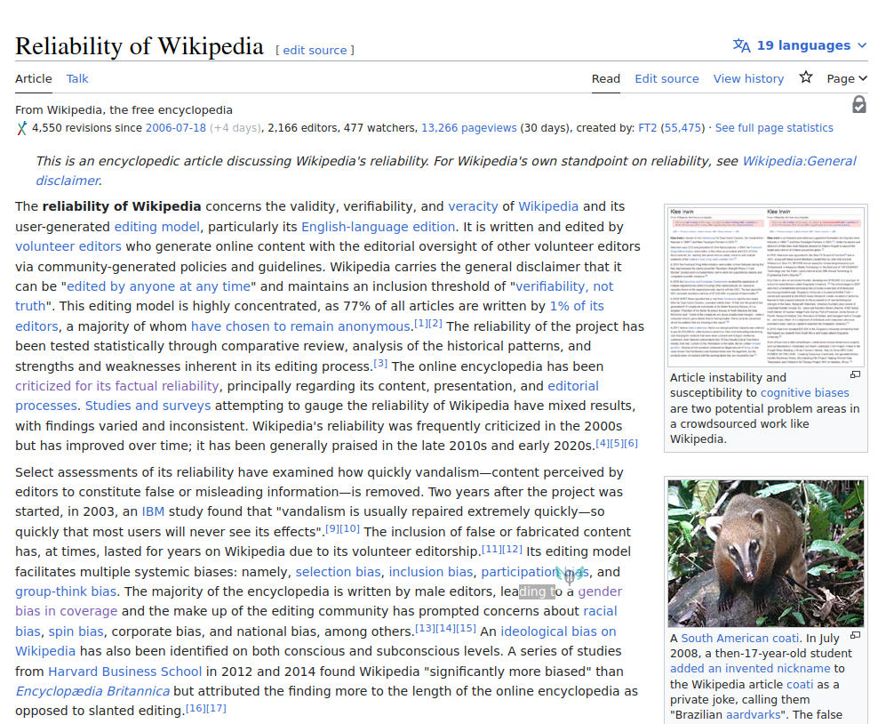
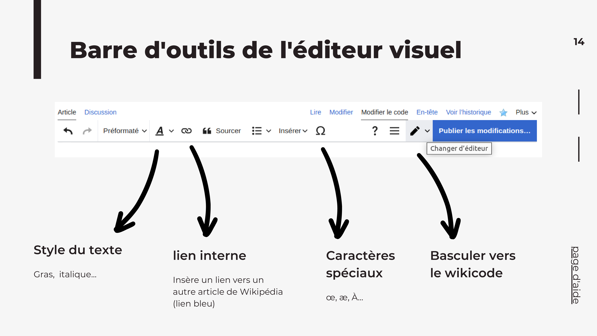
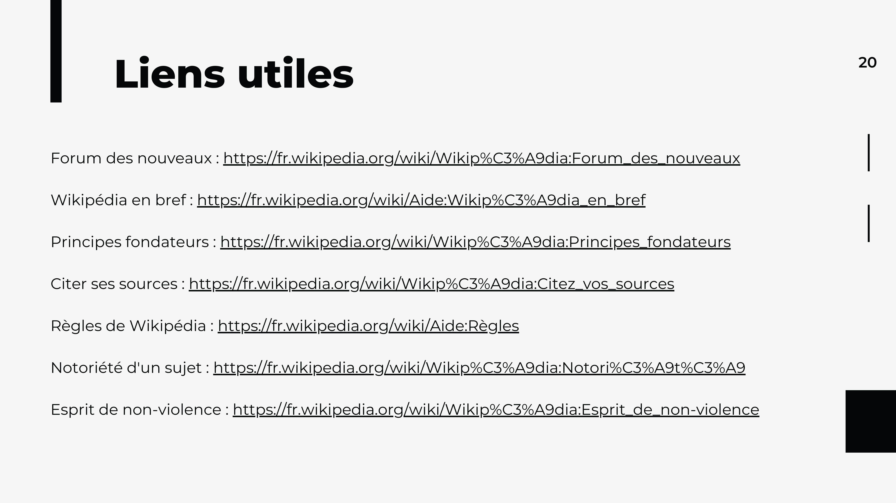

<!-- Scoped style -->

## Cite and add [my] researches on Wikipedia

Training workshop on Wikipedia  in order to increase your researches, notes or publications' discoverability.
 
<small><small><a class="link" href=https://fr.wikipédia.org/wiki/User:Hugo_en_résidence>Hugo Lopez - Wikimedian in residency</a>. https://notes.wikimedia.fr/p/UT</small></small>

---
### Hugo Lopez
- 2004 Wikipedian
- 2012 PhD Chinese elearning, developer
- 2016 Open education resources
- 2023 Wikimedian in residence

---
# Outline
1. Context
2. Wikipedia
3. Edit Wikipedia
4. Manual of style
5. Adapt my research to Wikipedia
6. Interact on Wikipedia
7. See also

---
# Training context
<!-- 09:40 -->
- Trainer
- Training: science and open science, open learning resources, open commons (Wikipedia)
- Pauses

---

---
<!-- 4 axes science ouverte -->

  
 

---
<!-- ### Statistiques historiques -->

---Transformer mes publications scientifiques en articles Wikipédia

### University of Toulouse & Open Education

- our historical values and missions
- collaborative digital commons practices

---

### Science and society

---

### Goals
<!-- 09:40: SLIDE 44 -->
At the end of the training, the learner:
- will know how to use the visual editor to add sourced assertions to Wikipedia
- will know the history systems for contributors, pages, and recent modifications
- will be able to identify among its research the valuable content on Wikipedia: the states of the art
- reformulate its content in an encyclopedic style
- will know paths for self-training and support forums

---
### Round table
<!-- 09:45 -->
- 1 minute 
- research team, fields, familiarity with wikipedia

---
### Few Questions

---
#### Usages
<!-- 10:00: Quantitative -->
- A) How many articles read / week:
   <10?
   <100?
   <1000?
- B) Who edited?
- C) Who read a discussion page
- D) Who discussed it?

---
#### Representations
<!-- 10:02: Qualitative -->
Reliability: On Wikipedia, errors and biases are
- A) frequent
- B) occasional
- C) rare
- D) never seen it, I only read academic articles

<!-- 
Discussion: 
- Quelle wikipédia, quels articles, quand ?
- Humilité de Wikipédia
-->
---
<!-- 10:06: ### Table d'évaluation -->

---
#### Why contribute to Wikipedia?
<!-- 10:06 -->

• What obstacles ?
• What motivations ?
<!-- 
Lister:
- 3mins + 3mns
- ses motivations 
- ses freins 
- échanger avec ses pairs ?
Feedback: relativiser.

---
<!-- 10:12 Motivation -- >

-->

---

---
<!-- 10:15 : Quantitatif -->
#### What contribution style ?
• A) Add some references, correct existing content
• B) Share some notes,
• C) Move out of the way! There are 25 pages of high quality academic publication on [Sumatran Geckos](https://en.wikipedia.org/wiki/Cyrtodactylus_santana), where in Wikipedia should I padte it ? Ò_Ó

---
<!-- 10:17  -->
# Wikipédia...
• Key facts

---
<!-- En chiffres -->

---
<!-- 10:20 Principes -->

<!--
---
 10:23 Licence libre 
 -->

---
<!-- Licence libre : échèle -->

---
<!-- 10:40 -->
### Coffee break (1)

---
<!-- 10:25 -->
### Create accounts

---
<!-- ### Création de compte -->

---

---
<!-- 11:00 -->
# Contribute to Wikipédia
<!--
 
-->

---
<!-- Menu personnel -->

---
### Jumping in : Create a draft !

---
<!-- 11:00 Barre Editeur visuel -->

---
<!-- 11:05 Modifier un article-->

---
<!-- 11:10 Sourcer  -->

<!---
• Être capable d'éditer un texte multi-média sur Wikipédia > L'interface d'édition
• Se créer une page brouillon > Edition d'un brouillon personnel
• Être capable d'éditer un texte scientifique sur Wikipédia > L'interface d'édition avancée, Édition d'un brouillon personnel avec formules
• Être capable d'éditer Wikipédia et ses modèles en copiant d'une autre page > Éditer un brouillons personnel avec modèle
-->

---
<!-- 11:15 Sourcer  -->
# Manual of style
- Explore and identify wikipedia articles's structure and [basic style](https://en.wikipedia.org/wiki/Wikipedia:Simplified_Manual_of_Style)
- Compare to your academic writings
- What shift are occuring ?

 <!--
---
### Inspect some articles!
Modality: in groups, 15mins.
Final rendering: sketch note and a presenter.
Questions :
- What structures?
- What styles and differences?

---
 ### Périmètre -- >

 -->

--- 
<!-- ### Structure d'un article Wikipédia -->

<!-- 
---
<!-- ### Grille d'évaluation -->

-->

<!---
• Distinguer les sections typiques d'un article encyclopédique de mon champs > Analyse d'articles Wikipédia
• Distinguer les sections typiques des articles académiques de mon champs > Analyse d'articles académiques
• Comparer et lier les recouvrements
• Identifier dans mes recherches les sections "portables" vers Wikipédia
• Discuter du style rédactionel des articles Wikipédia > Discuter avec collègue.
-->

---
<!-- Objectifs: -->
# Adapt my searches to Wikipedia
1. Draft a draft page
2. Add one of your readings or research
3. Adapt an academic text into an encyclopedic article

---
<!-- Repérages -->

---
<!-- Admissibilité -->

---
# Interaction on Wikipédia

---
<!-- Debatre -->

<!--
---
<!-- :00 -- >
Savoir interagir avec la communauté sur Wikipédia
• En cas de doute, chercher de l'aide, apprendre > Citer les lieux d'aide aux nouveaux.
• Cartographier lieux de discussion > Citer les lieux de discussion
• Cartographier les types d'interlocuteurs > Analyser l'historique ? Bestiaire ?
• Cartographier les roles (logiciels) sur Wikipédia > Citer les aidants et connaissants
<!-- -->

---
# See also

Article & metrics : Gascon
- [Article > Statistics](https://xtools.wmflabs.org/articleinfo/en.wikipedia.org/Gascon_dialect)
- [Article > Pageviews](https://pageviews.wmcloud.org/?project=en.wikipedia.org&platform=all-access&agent=user&redirects=0&range=this-year&pages=Gascon_dialect)

Listing knowledgeable volunteers on this field.

---

---
## Keep in touch

URFIST Occitanie
 <a href="https://fr.wikipedia.org/wiki/user:Hugo_en_résidence">User:Hugo en residence</a>
 Trainer in open digital commons
 Help in finalizing sections or articles on WP

---
<!-- Scoped style -->

## Keep in touch

Trainers in open digital commons. 

| Institution | Wikimédien en résidence | Specialité
|:---- |:---- |:---|
| URFIST Occitanie | <a href="https://fr.wikipedia.org/wiki/user_talk:Hugo_en_résidence">User:Hugo en résidence</a>  hugo.lopez@univ-toulouse.fr | Dev web, langues
| Musée de Bretagne | <a href="https://fr.wikipedia.org/wiki/user_talk:VIGNERON_en_résidence">User:VIGNERON en résidence</a> | Wikidata
| URFIST Bretagne+ | <a href="https://fr.wikipedia.org/wiki/user_talk:Juliette_en_résidence">User:Juliette en résidence</a> | Bibliothèques
| URFIST Bordeaux | <a href="https://fr.wikipedia.org/wiki/user_talk:Pyb_en_résidence">User:Pyb en résidence</a> | Com/réseau

---

[Projet:Wikifier la science/Infolettre](https://fr.wikipedia.org/wiki/Projet:Wikifier_la_science/Infolettre)

---
#### Thanks

All textual content is under free license.
Credit: Hugo Lopez, Amélie Charles CC-BY-SA 4.0.
The illustrations are the property of their respective authors.

---

### Sources

| File  |  Licence | Author
|:----|:----|:---
[Recommandation de l’UNESCO sur une science ouverte](https://www.unesco.org/en/open-science/about) | CC-BY-SA-3.0 | UNESCO 2021
[Deuxième Plan national pour la science ouverte](https://www.ouvrirlascience.fr/deuxieme-plan-national-pour-la-science-ouverte-pnso/) | CC-BY-4.0 | MESR 2021
[Why So Many Americans Are Losing Trust in Science](https://www.nytimes.com/2023/10/03/opinion/science-americans-trust-covid.html) | Copyrighted | M. Anthony Mills NYTimes

### Credits images 

| File  |  Licence | Author
|:----|:----|:---
File:LinguaLibre_2022_Paris_Surui_training-03.jpg | CC-BY-SA | Yug
File:Forom_des_langues,_Toulouse,_2023-01.jpg | CC-BY-SA | Yug

<!-- 
File:Human_Language_Families.png | CC-BY-SA | JFDP13
File:WikiLucas00_à_l'Institut_international_pour_la_Francophonie.jpg | CC-BY-SA | WikiLucas00
File:Daramlagon_and_Maerui-sama_session_on_Bikol_Wiktionary_and_Lingua_Libre_03.jpg | CC-BY-SA | Daramlagon
File:LinguaLibre_2022_Paris_Surui_training-03.jpg | CC-BY-SA | Yug
File:Forom_des_langues,_Toulouse,_2023-01.jpg | CC-BY-SA | Yug
|File:éance_Lingua_Libre_à_Cotonou_en_Mars_2021_-_Photo_17.jpg | CC-BY-SA | Fawaz.tairou
File:Lingua_Libre_Atikamekw_at_Wikimania_2017_Montreal.jpg | CC-BY-SA | Benoit Rochon
-->

<!-- 15:00 -- >
--- 

# TODO MRV
- [x] Pad :
- Timing
- Dashboard 
- Wikipage : [[User:Hugo en résidence/PHD]]
- Copier style du HDD
- Visiter la salle, mettre des feuille par groupe

- Print

--> 

