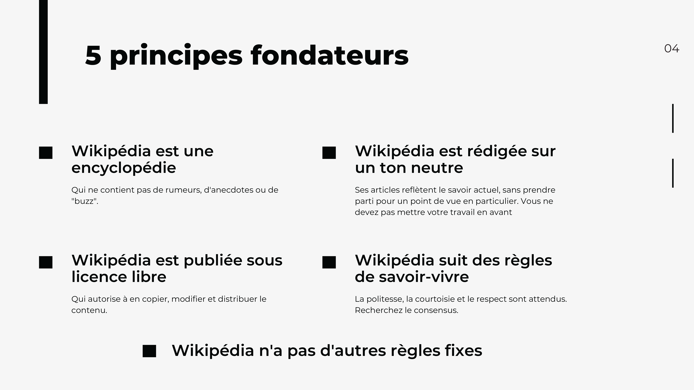
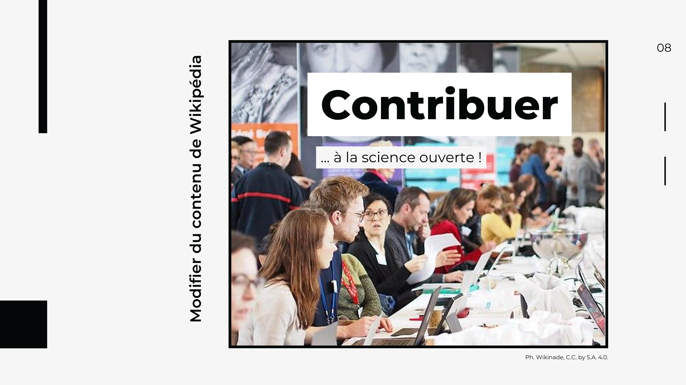
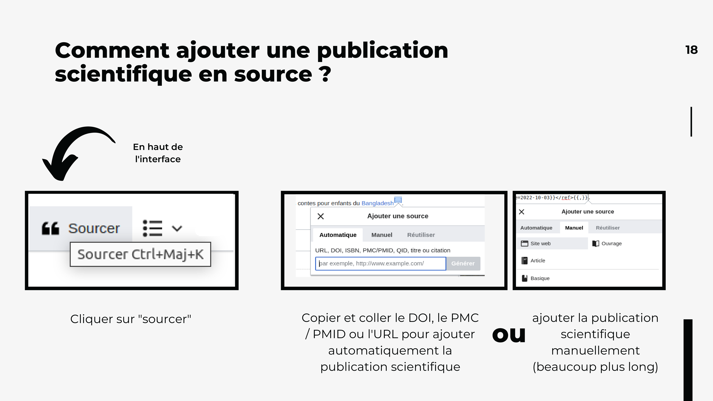
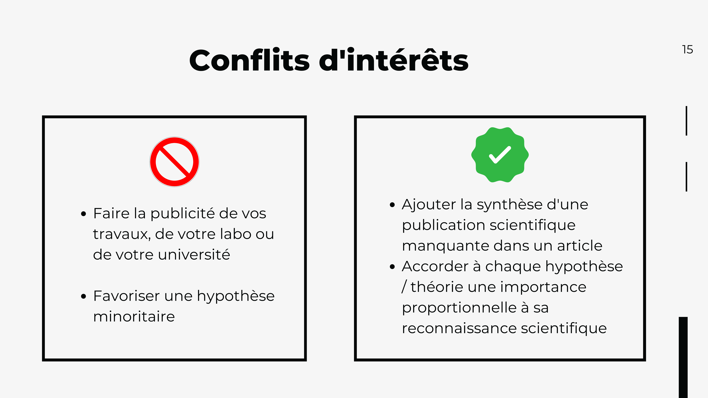
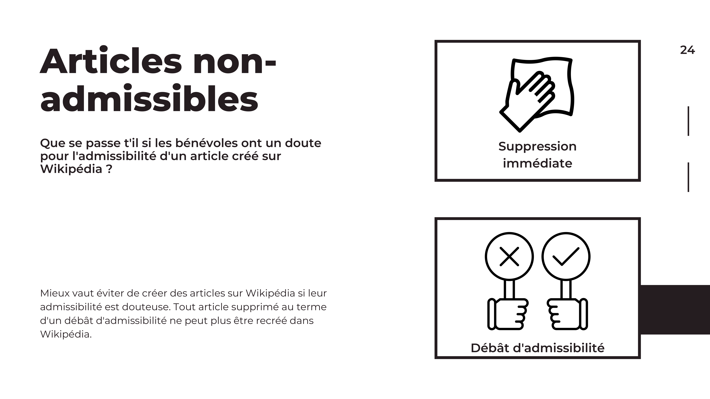

<!-- Scoped style -->

## Valoriser mes recherches sur Wikipédia

Atelier de formation à Wikipédia  afin d'y valoriser ses recherches, notes ou publications.
 
<small><small><a class="link" href=https://fr.wikipédia.org/wiki/User:Hugo_en_résidence>Hugo Lopez - Wikimédien en résidence</a>. https://notes.wikimedia.fr/p/UT</small></small>

---
### Hugo Lopez
- 2004 Wikipédien
- 2012 PhD Chinese elearning, développeur
- 2016 Open education resources
- 2023 Wikimédien en résidence

---
# Plan
1. Contexte
2. Wikipédia
3. Éditer Wikipédia
4. Questions de style
5. Adapter mes recherches à Wikipédia
6. Interagir sur Wikipédia
7. Pour aller plus loin

---
# Contexte de formation
<!-- 09:40 -->
- Formateur
- Formation : science et science ouverte, commun numériques libres (Wikipédia)
- Pause : 11h00

---

---
<!-- 4 axes science ouverte -->

 
 

---
<!-- ### Statistiques historiques -->

---

### University of Toulouse & Open Education
 

- valeurs et missions de l'université
- pratiques digitales collaboratives

---

### Science and society

---

### Objectifs
<!-- 09:40 : SLIDE 44 -->
En fin de formation, l'apprenant :
- saura utiliser l'éditeur visuel pour ajouter des affirmations sourcées à Wikipédia
- connaitra le systèmes d'historique pour les contributeurs, pages, et modifications récentes
- saura identifier parmis ses recherches les contenus valorisables sur Wikipédia : les états de l'art
- reformuler ses contenus au style encyclopédique
- connaitra les pistes d'auto-formations et discussion

---
### Tour de table
<!-- 09:45 -->
• 1 minute / pers

---
## Quelques questions

---
#### Vos usages
<!-- 10:00 : Quantitatif -->
- A) Combien d'articles lus / semaine : 
  <10 ?
  <100 ?
  <1000 ?
- B) Qui a édité ?
- C) Qui a lu une page de discussion
- D) Qui à discuté ?

---
#### Vos représentations
<!-- 10:02 : Qualitatif -->
Fiabilité: Sur Wikipédia, les erreurs et biais sont
- A) fréquents
- B) occasionels
- C) rares
- D) jamais vu, je ne lis que des articles académiques
<!-- 
Discussion: 
- Quelle wikipédia, quels articles, quand ?
- Humilité de Wikipédia
-->
---
<!-- 10:06: ### Table d'évaluation -->

---
#### Pourquoi éditer Wikipédia ?
<!-- 10:06 -->

• Quels freins ?
• Quelles motivations ?
<!-- 
Lister:
- 3mins + 3mns
- ses motivations 
- ses freins 
- échanger avec ses pairs ?
Feedback: relativiser.
-->

<!--
---
 10:12 Motivation
 -->

---

---
<!-- 10:15 : Quantitatif -->
#### Jusqu'où éditer Wikipédia ?
• A) Ajouter quelques références
• B) Partager quelques notes, corriger l'existant
• C) Move out ! Mon article peer reviewed [Les Geckos de Sumatra](https://en.wikipedia.org/wiki/Cyrtodactylus_santana) est sous CC-BY ! Où je colle ça !? Ò_Ó

---
<!-- 10:17  -->
# Wikipédia...
• Quelques éléments fondamentaux...

---
<!-- Origines -->
### Origines
- Internet mais chaotiques
- Des encyclopédies mais payantes
- Possibilité d'un effort commun

* Solution/innovation :
  * Wikipédia : l'Encyclopédie Libre !

---
<!-- Origines -->
### Modèle

- Autogérée
  - utilisateurs : décideurs, législateur, juges et acteurs
  - démocratiques : votes et sens commun
- Dons de temps : wikipediens
- Dons d'argent : donateurs
- Serveurs, supports, communauté

---
<!-- 10:20 Principes -->

---
<!-- En chiffres -->

<!--
---
<!-- 10:23 Licence libre -- >
 -->

---
<!-- Licence libre : échèle -->

---
<!-- 10:25 -->
### Création de compte

---
<!-- ### Création de compte -->

---

---
<!-- 10:40 -->
### Pause café (1)

---
<!-- 11:00 -->
# Éditer Wikipédia
<!--
 
-->

---
<!-- Menu personnel -->

---
### Test : Créez-vous un brouillon !

---
<!-- 11:00 Barre Editeur visuel -->

---
<!-- 11:05 Modifier un article-->

---
<!-- 11:10 Sourcer  -->

---
<!-- Repérages -->

<!---
• Être capable d'éditer un texte multi-média sur Wikipédia > L'interface d'édition
• Se créer une page brouillon > Edition d'un brouillon personnel
• Être capable d'éditer un texte scientifique sur Wikipédia > L'interface d'édition avancée, Édition d'un brouillon personnel avec formules
• Être capable d'éditer Wikipédia et ses modèles en copiant d'une autre page > Éditer un brouillons personnel avec modèle
-->
---
<!-- 11:15 Sourcer  -->
# Questions de styles
- Analyser la structure et le style des articles encyclopédiques
- Comparer à vos ressources académiques
- Quels recoupements ?

---
<!-- ### Périmètre -->

---
<!-- ### Structure d'un article Wikipédia -->

---
<!-- ### Différents avancements, différentes structures -->
### Différents avancements donc structures 

---
### Examinez quelques articles
Modalité : par groupes, 15mins.
Rendu final : sketch note et un présentant.
Questions : 
- Quelles structures ? 
- Quels styles et différences ?

<!---
• Distinguer les sections typiques d'un article encyclopédique de mon champs > Analyse d'articles Wikipédia
• Distinguer les sections typiques des articles académiques de mon champs > Analyse d'articles académiques
• Comparer et lier les recouvrements
• Identifier dans mes recherches les sections "portables" vers Wikipédia
• Discuter du style rédactionel des articles Wikipédia > Discuter avec collègue.
-->

---
<!-- Objectifs: -->
# Adapter mes recherches à Wikipédia
1. Ébaucher une page brouillon
2. Ajouter une de vos lectures ou recherches
3. Adapter un texte académique en fiche encyclopédique

---
<!-- Résumer une publication scientifique -->

---
<!-- Conflit d'interets -->

---
<!-- Admissibilité -->

---
<!-- Admissibilité -->

---
# Interagir sur Wikipédia

---
<!-- Debatre -->

---
<!-- Debatre -->

### Cible de Graham
Wikipédia: pour une argumentation collaborative et constructive, centrée sur les [sources fiables](https://fr.wikipedia.org/wiki/Wikipédia:Sources_fiables).

<!--
---
<!-- :00 -- >
Savoir interagir avec la communauté sur Wikipédia
• En cas de doute, chercher de l'aide, apprendre > Citer les lieux d'aide aux nouveaux.
• Cartographier lieux de discussion > Citer les lieux de discussion
• Cartographier les types d'interlocuteurs > Analyser l'historique ? Bestiaire ?
• Cartographier les roles (logiciels) sur Wikipédia > Citer les aidants et connaissants
<!-- -->

---
# Pour aller plus loin

Métriques d'articles : Gascon
- [Page statistics](https://xtools.wmflabs.org/articleinfo/en.wikipedia.org/Gascon_dialect)
- [Pageviews](https://pageviews.wmcloud.org/?project=en.wikipedia.org&platform=all-access&agent=user&redirects=0&range=this-year&pages=Gascon_dialect)

Permet d'identifier les connaissants bénévoles.

---

### Bienvenue à vous !
Les liens clefs sont sur [votre page de discussion](https://fr.wikipedia.org/wiki/Special:Login)
- [Forum des nouveaux](https://fr.wikipedia.org/wiki/Wikipédia:Forum_des_nouveaux) - WP:FDN
- [Wikipédia en bref](https://fr.wikipedia.org/wiki/Aide:Wikipédia_en_bref) - WP:BREF
- [5 Principes fondateurs](https://fr.wikipedia.org/wiki/Wikipédia:Principes_fondateurs) - WP:5P
- [Citer ses sources](https://fr.wikipedia.org/wiki/Aide:Citer_ses_sources) - WP:SOURCES
- [Règles de Wikipédia](https://fr.wikipedia.org/wiki/WP:REG) - WP:REG
- [Notoriété d'un sujet](https://fr.wikipedia.org/wiki/Wikipédia:Notoriété) - WP:N
- [Esprit de non violence](https://fr.wikipedia.org/wiki/Wikipédia:Esprit_de_non_violence) - WP:NV

---
## Restons en contact

URFIST Occitanie
 <a href="https://fr.wikipedia.org/wiki/user:Hugo_en_résidence">Utilisateur:Hugo en résidence</a>
 Formateur aux communs numériques ouverts
 Aide à la finalisation de sections ou articles sur WP

---
<!-- Scoped style -->

## Restons en contact

Formateurs aux communs numériques ouverts. 

| Institution | Wikimédien en résidence | Specialité
|:---- |:---- |:---|
| URFIST Occitanie | <a href="https://fr.wikipedia.org/wiki/user_talk:Hugo_en_résidence">User:Hugo en résidence</a>  hugo.lopez@univ-toulouse.fr | Dev web, langues
| Musée de Bretagne | <a href="https://fr.wikipedia.org/wiki/user_talk:VIGNERON_en_résidence">User:VIGNERON en résidence</a> | Wikidata
| URFIST Bretagne+ | <a href="https://fr.wikipedia.org/wiki/user_talk:Juliette_en_résidence">User:Juliette en résidence</a> | Bibliothèques
| URFIST Bordeaux | <a href="https://fr.wikipedia.org/wiki/user_talk:Pyb_en_résidence">User:Pyb en résidence</a> | Com/réseau

---

[Projet:Wikifier la science/Infolettre](https://fr.wikipedia.org/wiki/Projet:Wikifier_la_science/Infolettre)

---
#### Remerciements

Tous les contenus textuels sont sous licence libre.
Crédit: Hugo Lopez, Amélie Charles CC-BY-SA 4.0.
Les illustrations sont la propriété de leurs auteurs respectifs.

---

### Sources

| File  |  Licence | Author
|:----|:----|:---
[Recommandation de l’UNESCO sur une science ouverte](https://www.unesco.org/en/open-science/about) | CC-BY-SA-3.0 | UNESCO 2021
[Deuxième Plan national pour la science ouverte](https://www.ouvrirlascience.fr/deuxieme-plan-national-pour-la-science-ouverte-pnso/) | CC-BY-4.0 | MESR 2021
[Why So Many Americans Are Losing Trust in Science](https://www.nytimes.com/2023/10/03/opinion/science-americans-trust-covid.html) | Copyrighted | M. Anthony Mills NYTimes
Cible de graham | CC-0 | Nathan Uyttendaele

### Credits images 

| File  |  Licence | Author
|:----|:----|:---
File:LinguaLibre_2022_Paris_Surui_training-03.jpg | CC-BY-SA | Yug
File:Forom_des_langues,_Toulouse,_2023-01.jpg | CC-BY-SA | Yug

<!-- 
File:Human_Language_Families.png | CC-BY-SA | JFDP13
File:WikiLucas00_à_l'Institut_international_pour_la_Francophonie.jpg | CC-BY-SA | WikiLucas00
File:Daramlagon_and_Maerui-sama_session_on_Bikol_Wiktionary_and_Lingua_Libre_03.jpg | CC-BY-SA | Daramlagon
File:LinguaLibre_2022_Paris_Surui_training-03.jpg | CC-BY-SA | Yug
File:Forom_des_langues,_Toulouse,_2023-01.jpg | CC-BY-SA | Yug
|File:éance_Lingua_Libre_à_Cotonou_en_Mars_2021_-_Photo_17.jpg | CC-BY-SA | Fawaz.tairou
File:Lingua_Libre_Atikamekw_at_Wikimania_2017_Montreal.jpg | CC-BY-SA | Benoit Rochon
-->

<!-- 15:00 -- >
--- 

# TODO MRV
- [x] Pad :
- Timing
- Dashboard 
- Wikipage : [[User:Hugo en résidence/PHD]]
- Copier style du HDD
- Visiter la salle, mettre des feuille par groupe

- Print

--> 