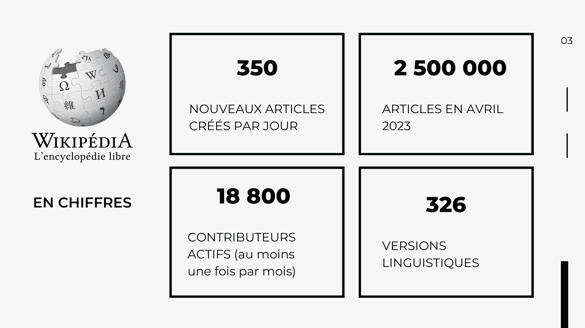

<!-- Scoped style -->

# Wikipédia et Recherche (ouverte)
 
 
<small><a class="link" href=https://fr.wikipédia.org/wiki/User:Hugo_en_résidence>Hugo Lopez - Wikimédien en résidence</a>.
 Toulouse, 2024.03.08</small>

---
### Hugo Lopez
- 2004 Wikipédien
- 2012 PhD Chinois et elearning
- 2016 Ressources éducatives libres
- 2023 Wikimédien en résidence

---
# Plan

1. Wikimédiens en Résidence
2. Contexte institutionnel
3. Wikipédia: relai de la recherche
4. Wikipédia: outil de la recherche
5. Wikipédia: visibiliser la recherche

---
#### Vos usages
<!-- 10:00 : Quantitatif -->
- A) Combien d'articles lus / semaine : 
  <10 ?
  <100 ?
  <1000 ?
- B) Qui a édité ?
- C) Qui a lu une page de discussion
- D) Qui à discuté ?

---
# Wikimédiens en Résidence

---

---

---

---

---

---

---

---

---
# Contexte institutionnel

---
<!-- ### Statistiques historiques -->

---

---
<!-- 4 axes science ouverte -->

 
 

---

---

---

### Université de Toulouse
 

- valeurs et missions de l'université

---

### Science et société

---
# Wikipédia, relai de la recherche
Wikipédia permet la diffusion des synthèses de la recherche dans le quotidien des citoyens.

---

---

#####  Large domaine
<!-- En chiffres -->

---
##### Open science friendly
<!-- 10:20 Principes -->

---

---

---

---

---

---
<!-- 4 axes science ouverte -->

- Améliorable
- Renforcer les liens avec la recherche
 

---
# Wikipédia outil de la recherche
Wikipédia comme outil pour la recherche.

---

---

---
# Wikipédia pour visibiliser la recherche
Wikipédia pour visibiliser vos recherches.

---

---
### Editons wikipédia
- Un outils d'édition scientifique
- Ajout de sources : Zotero

---

<!-- 11:00 Barre Editeur visuel -->

---
### Mise en place de stratégies Wikipédia

---

<!-- Strategy 1 -->

<!--
---

<!-- Strategy 2 - ->
 

 -->

---

<!-- Strategy 2 -->

---

<!-- Strategy 3 -->
##### Stratégie 3: Illustrer Wikipedia

---

<!-- Strategy 4 -->
##### Stratégie 4: Traduire les articles

---
### Métriques d'articles
[Méthode électro-accoustique pulsée]
- [Page statistics](https://xtools.wmflabs.org/articleinfo/fr.wikipedia.org/Méthode_électro-accoustique_pulsée)
- [Pageviews](https://pageviews.wmcloud.org/?project=fr.wikipedia.org&platform=all-access&agent=user&redirects=0&range=this-year&pages=Méthode_électro-accoustique_pulsée)

---
# Interagir sur Wikipédia
Differentes cultures.

---
<!-- Debatre -->

---
<!-- Debatre -->

### Cible de Graham
Wikipédia: pour une argumentation collaborative et constructive, centrée sur les [sources fiables](https://fr.wikipedia.org/wiki/Wikipédia:Sources_fiables).

<!--
---
<!-- :00 -- >
Savoir interagir avec la communauté sur Wikipédia
• En cas de doute, chercher de l'aide, apprendre > Citer les lieux d'aide aux nouveaux.
• Cartographier lieux de discussion > Citer les lieux de discussion
• Cartographier les types d'interlocuteurs > Analyser l'historique ? Bestiaire ?
• Cartographier les roles (logiciels) sur Wikipédia > Citer les aidants et connaissants
<!-- -->

---

### Bienvenue à vous !
Les liens clefs sont sur [votre page de discussion](https://fr.wikipedia.org/wiki/Special:Login)
- [Forum des nouveaux](https://fr.wikipedia.org/wiki/Wikipédia:Forum_des_nouveaux) - WP:FDN
- [Wikipédia en bref](https://fr.wikipedia.org/wiki/Aide:Wikipédia_en_bref) - WP:BREF
- [5 Principes fondateurs](https://fr.wikipedia.org/wiki/Wikipédia:Principes_fondateurs) - WP:5P
- [Citer ses sources](https://fr.wikipedia.org/wiki/Aide:Citer_ses_sources) - WP:SOURCES
- [Règles de Wikipédia](https://fr.wikipedia.org/wiki/WP:REG) - WP:REG
- [Notoriété d'un sujet](https://fr.wikipedia.org/wiki/Wikipédia:Notoriété) - WP:N
- [Esprit de non violence](https://fr.wikipedia.org/wiki/Wikipédia:Esprit_de_non_violence) - WP:NV

---
## Restons en contact

URFIST Occitanie
 <a href="https://fr.wikipedia.org/wiki/user:Hugo_en_résidence">Utilisateur:Hugo en résidence</a>
 Formateur aux communs numériques ouverts

---
<!-- Scoped style -->

## Restons en contact

Formateurs aux communs numériques ouverts. 

| Institution | Wikimédien en résidence | Specialité
|:---- |:---- |:---|
| URFIST Occitanie | <a href="https://fr.wikipedia.org/wiki/user_talk:Hugo_en_résidence">User:Hugo en résidence</a>  hugo.lopez@univ-toulouse.fr | Dev web, langues
| Musée de Bretagne | <a href="https://fr.wikipedia.org/wiki/user_talk:VIGNERON_en_résidence">User:VIGNERON en résidence</a> | Wikidata
| URFIST Bretagne+ | <a href="https://fr.wikipedia.org/wiki/user_talk:Juliette_en_résidence">User:Juliette en résidence</a> | Bibliothèques
| URFIST Bordeaux | <a href="https://fr.wikipedia.org/wiki/user_talk:Pyb_en_résidence">User:Pyb en résidence</a> | Com/réseau

---

[Projet:Wikifier la science/Infolettre](https://fr.wikipedia.org/wiki/Projet:Wikifier_la_science/Infolettre)

---
#### Remerciements

Tous les contenus textuels sont sous licence libre.
Crédit: Hugo Lopez, Amélie Charles, Pierre Yves Beaudouin CC-BY-SA 4.0.
Les illustrations sont la propriété de leurs auteurs respectifs.
