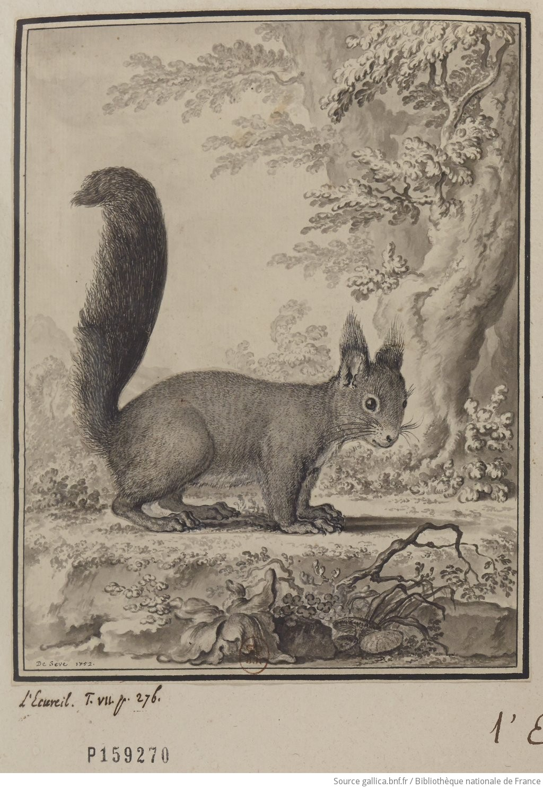

<!-- Scoped style -->

Libérez vos documents illustrés grâce à ...
# Bing Image Creator  <small><small>(DALL·E 3 → bing.com/create)</small> 
</small><small>

[Hugo Lopez](https://fr.wikipedia.org/wiki/User:Hugo_en_résidence)
Wikimédien en résidence #SNU2024
hugo.lopez@univ-toulouse.fr
</small>

---
### Hugo Lopez
- 2004 Wikipédien
- 2012 Doctorant en e-learning
- 2016 Ingénieur MOOC et ressources éducatives libres
- 2023 Wikimédien en résidence

---

---
### Observateur du Machine learning
<table style="margin-left:0;">
<tr><td><small>

- L'éducation libre implique une veille technique
- 2022.11: 🤖💬 ChatGPT !
- 2022.12: 👀 [Observatoire du Machine Learning pour Wikimedia](https://discord.com/channels/537685109718122506/1057614282453426288).
</small>
</td><td>

</td>
</tr>
</table>

---
# Plan
<table style="margin-left:0;">
<tr>
<td>

1. Objectifs 
2. Libérons nos contenus !      
3. Générateurs d'images !
4. Bing Image Créator
5. Allons plus loin
6. Q&A

</td><td>

</td>
</tr>
</table>

---
# Objectifs
<table style="margin-left:0;">
<tr>
<td>

1. Utiliser Bing image créator 
2. Prendre consience du potentiel pour liberer nos contenus.
3. Explorer le champs

</td><td>

</td>
</tr>
</table>

---
# Libérez vos documents avec l'IA !
Mettons sous licence libre des matériaux riches : une impossibilité ?

---
### Les directives

---

### Université de Toulouse
 

- Valeurs et missions de l'université

---
### Licences libres
<!-- Licence libre : échèle -->

---
### L'existant

<table style="margin-left:0;">
<tr>
<td>

</td><td>

[Bonnes pratiques pour les collections scientifiques et techniques](https://fr.wikipedia.org/wiki/Aide:Bonnes_pratiques_pour_les_collections_scientifiques_et_techniques#Institutions)
</td>
</tr>
</table>

---
### L'existant

<table style="margin-left:0;">
<tr>
<td>

</td><td>

**Image sans autorisation** (Getty, ...). 
= Document sous droits. 
= Diffusion interdite ! sinon: violation de droits d'auteurs !
</td>
</tr>
</table>

---
### Recréation

<table style="margin-left:0;">
<tr>
<td>

</td><td>
Bing
</td><td>

</td>
</tr>
</table>

---
### Le document libéré !

<table style="margin-left:0;">
<tr>
<td>

</a>
</td><td> wiki
</td><td>

</td>
</tr>
</table>
<small>Image libre (CC0), document libre (CC-BY), et hop ! Sur Wikipédia !</small>

---
### Citation

---
# Les générateurs d'images

<table style="margin-left:0;text-align:center;margin: 0 auto; font-size:90%;">
<tr>
<td>Prompt</td>
<td>Génération</td>
</tr>
<tr>
<td>

</td><td>

</td>
</tr>
</table>

---
### Quelques générateurs

---
### Palette.fm : colorize images
<table style="margin-left:0;">
<tr>
<td>

- [Palette.fm](https://palette.fm)

</td><td>

</td>
</tr>
</table>

---
### Palette.fm : colorize images

<table style="margin:0 auto;text-align:center;">
<tr>
<td>

</td><td>
Palette.fm
</td><td>

</td>
</tr>
</table>

---
### SuperDescribe
<table style="margin-left:0;">
<tr>
<td>

- [SuperDescribe](https://chat.openai.com/g/g-9qWC0oyBd-super-describe) 
<small>© @javilopen</small>

</td><td>

</td>
</tr>
</table>

---
### Sketching
<table style="margin-left:0;">
<tr>
<td>

- [Python Scribe](https://www.reddit.com/r/StableDiffusion/comments/12pcbne/i_mad_a_python_script_the_lets_you_scribble_with/?utm_source=share&utm_medium=web3x&utm_name=web3xcss&utm_term=1&utm_content=share_button)

 
<small>© 12pcbne</small>

</td><td>

</td>
</tr>
</table>

---
### Plugins ChatGPT Plus
<table style="margin-left:0;">
<tr>
<td>

- ChatGPT +: 20€/mois
- [GPTstore.ia](https://gptstore.ai/gpts/categories/image-generation)

</td><td>

</td>
</tr>
</table>

---
# Copilot Designer

Précédement « Bing Image creator »

---
## Copilot Designer
<table style="margin-left:0;">
<tr>
<td>

</td><td>

</td>
</tr>
</table>

---
### DALL-E : progrès récents v.2 à v.3
  

---
### DALL-E : variations (prompt engineering)
   

---
### DALL-E : séries stylisées
<table style="margin:0;padding:.1em;text-align:left;"><td>

</td><td>
<small>
A cute {orange ball}. View: wide. Background: white. Style: simplified manga. </small>
</td>
</table>

---
### Vos créations + Prompt engineering
<small>

> A field of tulips in different colors under a blue sky.
> View: wide view. Background: white. Style: photo realistic.

> A ant eating a blue berry.
> View: wide view. Background: white. Style: photo realistic.

> A benevolent young red dragon resting upon a rich babel tower library.
> View: wide. Background: white. Style: simplified manga.

> A Polar bear painting an Easter egg in a tropical forest.
>View: wide. Background: tropical forest. Style: photo resalistic.

</small>

---
### Jurisprudence
- Discussions en cours, ex: [Wikimédiens](https://commons.wikimedia.org/wiki/Commons:AI-generated_media).
- Les créations sont libre de droits :
 *US Copyright Office repeatedly confirmed [...] that AI-created artworks that lack human authorship are ineligible for copyright.* ([source](https://www.smithsonianmag.com/smart-news/us-copyright-office-rules-ai-art-cant-be-copyrighted-180979808/))

---
### Régulations

> "A place to start [for A.I. regulation] is with the frameworks policymakers have already put forward to govern A.I. The two major proposals, at least in the West, are the “Blueprint for an A.I. Bill of Rights,”[2] which the White House put forward in 2022, and the Artificial Intelligence Act[3], which the European Commission proposed in 2021. Then, last week, China released its latest regulatory approach[4]." -- Klein[1], New York Times 2023.04.16. Ref: [1](https://www.nytimes.com/2023/04/16/opinion/this-is-too-important-to-leave-to-microsoft-google-and-facebook.html), [2](https://www.whitehouse.gov/ostp/ai-bill-of-rights/), [3](https://digital-strategy.ec.europa.eu/en/library/proposal-regulation-laying-down-harmonised-rules-artificial-intelligence), [4](http://www.cac.gov.cn/2023-04/11/c_1682854275475410.htm).

---
### Ethique des GIs

<table style="margin-left:0;">
<tr>
<td>

- Entrainés sur des corpus visuels sous droits
- Peut reproduire des oeuvres sous droits
- Conflits moraux/légaux créateurs vs IA Générative

Ref: [1](https://www.theverge.com/2023/1/17/23558516/ai-art-copyright-stable-diffusion-getty-images-lawsuit), [2](https://www.lapresse.ca/actualites/2022-10-10/intelligence-artificielle/l-art-de-copier-sans-payer.php), [3](https://www.clubic.com/getty-images/actualite-438627-au-tour-de-getty-de-bannir-les-images-generees-par-ia-par-peur-de-probleme-de-droits-d-auteur.html), [4](https://medium.com/graphic-language/my-case-against-ai-ad6489e124f2).

</td><td>

© [tw:@_mimimaru](https://twitter.com/_mimimaru/status/1748787718379999628)

</td>
</tr>
</table>

---
### Hallucinations

<table style="margin-left:0;">
<tr>
<td>

- Les générations textes / images sont "probabilistiques".
- Contient des erreurs.
- N'est **PAS** factuel.
- **Examiner le résultat.**
- **accorder les usages avec le public.**

</td><td>

</td>
</tr>
</table>

---
## Allons plus loin

---
### Exercez vous
<small>
<table style="margin-left:0;">
<tr>
<td>

- Google: Gallica écureuil (domaine public)
- [Palette.fm](https://palette.fm) > recoloriser

</td><td>

</td>
</tr>
</table>
</small>

---
### Optimisations

<small>
<table style="margin-left:0;">
<tr>
<td>

- [Replicate.com](https://replicate.com/explore)
- Banque de modèles.

</td><td>

</td>
</tr>
</table>
</small>

---
### Amélioration (upscaling)
<small>
<table style="margin:0 auto;text-align:center;">
<tr>
<td>

</td><td style="text-align:center;">

[Clarity-upscaler](https://replicate.com/philz1337x/clarity-upscaler)

</td><td>

</td>
</tr>
</table>
</small>

---
### APIs
→ https://platform.openai.com/docs/api-reference/images

---
### Banques d'images libres
- https://openaccessweek.org/resources

---
# Q&A

---
## Restons en contact

URFIST Occitanie
 <a href="https://fr.wikipedia.org/wiki/user:Hugo_en_résidence">Utilisateur:Hugo en résidence</a>
 Formateur aux communs numériques ouverts

---
<!-- Scoped style -->

## Restons en contact

Formateurs aux communs numériques ouverts. 

| Institution | Wikimédien en résidence | Specialité
|:---- |:---- |:---|
| URFIST Occitanie | <a href="https://fr.wikipedia.org/wiki/user_talk:Hugo_en_résidence">User:Hugo en résidence</a>  hugo.lopez@univ-toulouse.fr | Dev web, langues
| Musée de Bretagne | <a href="https://fr.wikipedia.org/wiki/user_talk:VIGNERON_en_résidence">User:VIGNERON en résidence</a> | Wikidata
| URFIST Bretagne+ | <a href="https://fr.wikipedia.org/wiki/user_talk:Juliette_en_résidence">User:Juliette en résidence</a> | Bibliothèques
| URFIST Bordeaux | <a href="https://fr.wikipedia.org/wiki/user_talk:Pyb_en_résidence">User:Pyb en résidence</a> | Com/réseau

---

[Projet:Wikifier la science/Infolettre](https://fr.wikipedia.org/wiki/Projet:Wikifier_la_science/Infolettre)

---
#### Remerciements

Tous les contenus textuels sont sous licence libre.
Crédit: Hugo Lopez CC-BY-SA 4.0.
Les illustrations sont la propriété de leurs auteurs respectifs.

---
### Machine learning
<table style="margin-left:0;">
<tr>
<td>

- [Explication des modèles languagiers comme représentation du monde réel](https://twitter.com/ZainHasan6/status/1726795714531901500).
<small>
</td><td>

</td>
</tr>
</table>

