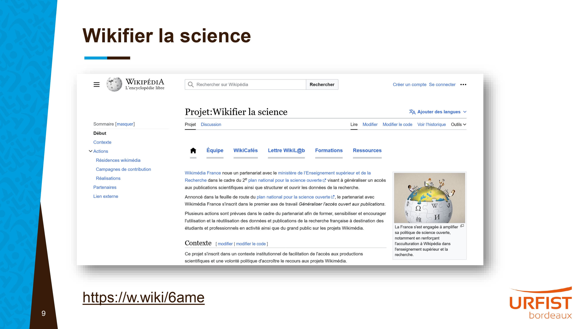
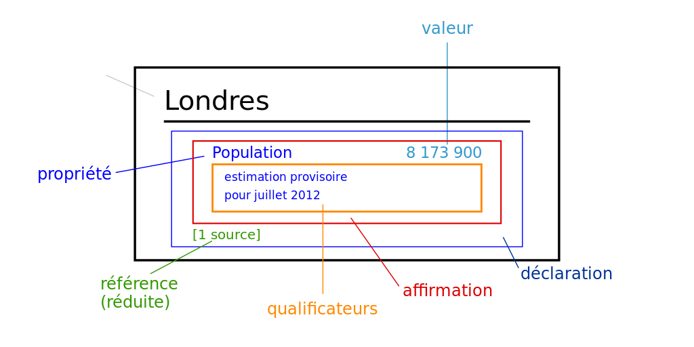
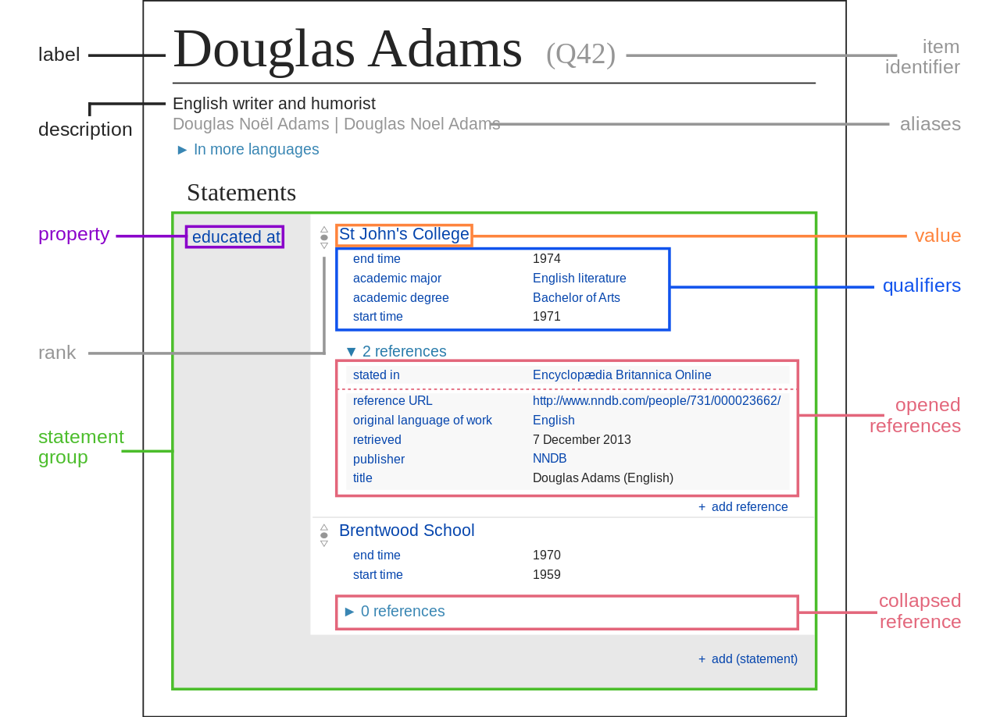
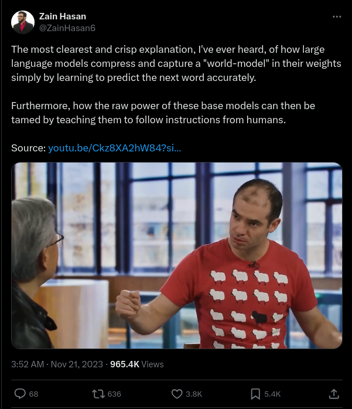

<!-- Scoped style -->
<style scoped>
h2 {
  background: none;
  color: #f68712!important;
  box-shadow: none;
}
h1 { 
    font-size: 1.7em;
}
h2:hover {
  box-shadow: none;
}
p { text-align:center; }

</style>

# Introduction à DBpedia.org
du point de vue d'un wikimedien.

<br>

[Hugo Lopez](https://fr.wikipedia.org/wiki/User:Hugo_en_résidence)
Wikimédien en résidence #SNU2024
hugo.lopez@univ-toulouse.fr
</small>

---
### Hugo Lopez
- 2004 Wikipédien
- 2012 Doctorant en e-learning
- 2016 Ingénieur MOOC et ressources éducatives libres
- 2023 Wikimédien en résidence


---
<style scoped>
header, footer { display: none;  }
</style>


---
# Objectifs
1. Tour d'horizon DBpedia
2. Requete DBpedia
3. vs Wikidata ?
4. Retour d'expérience générale

---
# Historique

---
<style scoped>
h3, table { margin:0; }
th {display:none;} 
table td { font-size: 70%; padding:.15em; border:0; }
tr > td:nth-child(1) { font-size: 110%; }
i { color: gold; font-style:normal; }
</style>
### 2006: Linked Open Data
| | | |
|:---|---|:---| 
| ☆☆☆☆☆ | OA |  Available online (whatever format)'s : Open Access
| ☆☆☆☆<i>★</i> | OL |  Available online, open licence's Open Data (e.g. image scan)
| ☆☆☆<i>★★</i> | RE |  Previous + machine-readable structured data (e.g. excel table)
| ☆☆<i>★★★</i> | OF |  Previous + open format (e.g. CSV)
| ☆<i>★★★★</i> | URI | Previous + open unique identifiers or URLs (URIs) to identify and point to things (e.g. RDF and SPARQL) 
| <i>★★★★★</i> | LD |  Previous + publicly link your data to other open data (e.g. FranceArchive P9371, EOL P830)

---
### 2007: DBpedia


<small>[Growth of Linked Open Data since 2007](https://www.researchgate.net/figure/Growth-of-Linked-Open-Data-since-2007-1-The-amount-of-data-sets-published-as-LOD-have_fig2_331748480), Matthias Frank (2017) </small>


---
### 2012: Wikidata


<small>[Wikidata in the Linked Open Data cloud](https://commons.wikimedia.org/wiki/File:Wikidata_in_the_Linked_Open_Data_cloud_2020-08-20.svg), Thomas Shafee (2020)</small>

---
# DBpedia ?
---
### Qu'est-ce que DBpedia ?
>_DBpedia_: The semantic extraction of information
from Wikipedia is accomplished using the DBpedia
Information Extraction Framework (DIEF) [6] [...] from several [Wikimedia] sources [...] extraction is performed by a set of pluggable Extractors, which rely on certain Parsers for different data types. 
--<small>Ismayilov & co (2016) : [Wikidata through the Eyes of DBpedia](https://www.semantic-web-journal.net/system/files/swj1462.pdf).</small>

---


---


---


---


---


---


---
<style scoped>
* { font-size: 87%; }
</style>

| Dimensions  |  Dbpedia | Wikidata
|:----|:----|:---
| Role | Extraction de WP | Centralisation de WP et +
| Curation | Scripts extracteurs | Scripts et utilisateurs
| Licence | CC-BY-SA-3.0 | CC0
| Identifiers | titres de en:wp | Qids
| Structure | RDF | RDF+ (sources)
| Schema | Basée sur OWL | Onthologie locale 
| Périodicité | 4/an | Continue
| Accès | URIs, Dumps, SPARQL | Idem
| Communauté | Academique | Bénévoles
| Contributif en ligne | Non | Oui
| Statements | 0.5B (en) | 1.54B (all)
| SPARQL Query | [dbpedia.org/sparql](https://dbpedia.org/sparql) | [query.wikidata.org](https://query.wikidata.org)
| Propriétés | [3,000](https://www.dbpedia.org/resources/ontology/) or 50k[¹](https://dbpedia.org/sparql?default-graph-uri=http%3A%2F%2Fdbpedia.org&query=SELECT+(COUNT(DISTINCT+%3Fpred)+AS+%3Fcount)%0D%0AWHERE+{%3Fpred+a+rdf%3AProperty.}&format=text%2Fhtml) | [11,713](https://www.wikidata.org/wiki/Wikidata:List_of_properties)[²](https://w.wiki/9Y8Y)

---
### Exemple: Vega
| Titre | URL
|:---|:---
| [Vega](https://en.wikipedia.org/wiki/Vega) | en.wikipedia.org/wiki/Vega
| [Vega](https://dbpedia.org/page/Vega) | dbpedia.org/page/Vega
| [Q3427](https://wikidata.org/wiki/Q3427) | wikidata.org/wiki/Q3427

---
### Query
[dbpedia.org/sparql](https://dbpedia.org/sparql)
```
SELECT ?body ?magnitude WHERE {
   ?body a dbo:CelestialBody .
   ?body dbp:appmagV ?magnitude .
   FILTER (?magnitude  < 1)
}
ORDER BY ?magnitude
LIMIT 100
```

---
# 2012: Wikidata


---
### Query
[query.wikidata.org](https://query.wikidata.org) > [9Xv\$](https://w.wiki/9Xv$)

```
SELECT  ?star ?starLabel ?apparent_magnitude
WHERE {
  SERVICE wikibase:label { bd:serviceParam wikibase:language "en". }
  { SELECT  ?star ?apparent_magnitude
    WHERE {   
      ?star wdt:P31 wd:Q523;
            wdt:P1215 ?apparent_magnitude.
      FILTER(?apparent_magnitude < 1)
    } LIMIT 10 
  }
} ORDER BY (?apparent_magnitude)
```

---
<small>

### Glossaire Wikidata
| En | Fr |
|:---|:---|
|  | 
<!--
| item | élément
| label | libélé, nom, titre
| statement | déclaration
| propery | propriété 
| reference | sources
| qualifier | qualificateur
-->
- label -> libélé
</small>

---
### Glossaire Wikidata
| En | Fr |
|:---|:---|
|  | 

---
# Allons plus loin

---
### Graphs et Machine learning
<table style="margin-left:0;">
<tr>
<td>

- [Explication des modèles languagiers comme représentation du monde réel](https://twitter.com/ZainHasan6/status/1726795714531901500).
<small>
</td><td>


</td>
</tr>
</table>

---
## Restons en contact
<center>
URFIST Occitanie
<br><a href="https://fr.wikipedia.org/wiki/user:Hugo_en_résidence">Utilisateur:Hugo en résidence</a>
<br>Formateur aux communs numériques ouverts

</center>

---
<!-- Scoped style -->
<style scoped>
table * { font-size: .9em;}
</style>
## Restons en contact
<center>Formateurs aux communs numériques ouverts.<br></center>

| Institution | Wikimédien en résidence | Specialité
|:---- |:---- |:---|
| URFIST Occitanie | <a href="https://fr.wikipedia.org/wiki/user_talk:Hugo_en_résidence">User:Hugo en résidence</a><br> hugo.lopez@univ-toulouse.fr | Dev web, langues
| Musée de Bretagne | <a href="https://fr.wikipedia.org/wiki/user_talk:VIGNERON_en_résidence">User:VIGNERON en résidence</a> | Wikidata
| URFIST Bretagne+ | <a href="https://fr.wikipedia.org/wiki/user_talk:Juliette_en_résidence">User:Juliette en résidence</a> | Bibliothèques
| URFIST Bordeaux | <a href="https://fr.wikipedia.org/wiki/user_talk:Pyb_en_résidence">User:Pyb en résidence</a> | Com/réseau

---
<div class="center">

[Projet:Wikifier la science/Infolettre](https://fr.wikipedia.org/wiki/Projet:Wikifier_la_science/Infolettre)


</div>

---
#### Remerciements

Tous les contenus textuels sont sous licence libre.
Crédit: Hugo Lopez, Julien Cojan, Pierre Yves Beaudoui CC-BY-SA 4.0.
Les illustrations sont la propriété de leurs auteurs respectifs.

---
<style scoped>
* { font-size: 83%; }
</style>
### Sources

| File  |  Licence | Author
|:----|:----|:---
[DBpedia en Francais : Tutoriel](https://commons.wikimedia.org/wiki/File:Tutoriel_Mappings_pour_DBpedia.pdf) | CC-BY-SA-3.0 | Julien Cojan 2013, Inria
[Deuxième Plan national pour la science ouverte](https://www.ouvrirlascience.fr/deuxieme-plan-national-pour-la-science-ouverte-pnso/) | CC-BY-4.0 | MESR 2021

### Credits images 

| File  |  Licence | Author
|:----|:----|:---
[Growth of Linked Open Data 2007-2017](https://www.researchgate.net/figure/Growth-of-Linked-Open-Data-since-2007-1-The-amount-of-data-sets-published-as-LOD-have_fig2_331748480)| CC-BY-SA | Matthias Frank (2017)
[Wikidata in the Linked Open Data cloud](https://commons.wikimedia.org/wiki/File:Wikidata_in_the_Linked_Open_Data_cloud_2020-08-20.svg)| CC-BY-SA | Thomas Shafee (2020)
[Wikidata_statement.svg](https://commons.wikimedia.org/wiki/File:Wikidata_statement.svg) | PD | Sarang
[Wikidata_statement-fr.svg](https://commons.wikimedia.org/wiki/File:Wikidata_statement-fr.svg)| CC-BY-SA | Alt0160
[Datamodel_in_Wikidata.svg](https://commons.wikimedia.org/wiki/File:Datamodel_in_Wikidata.svg) | CC0 | Charlie Kritschmar (WMDE)
[Datamodel_in_Wikidata_fr.svg](https://commons.wikimedia.org/wiki/File:Datamodel_in_Wikidata_fr.svg) | CC0 | Envel Le Hir
[Explication des modèles languagiers](https://twitter.com/ZainHasan6/status/1726795714531901500) | (c) | Twitter