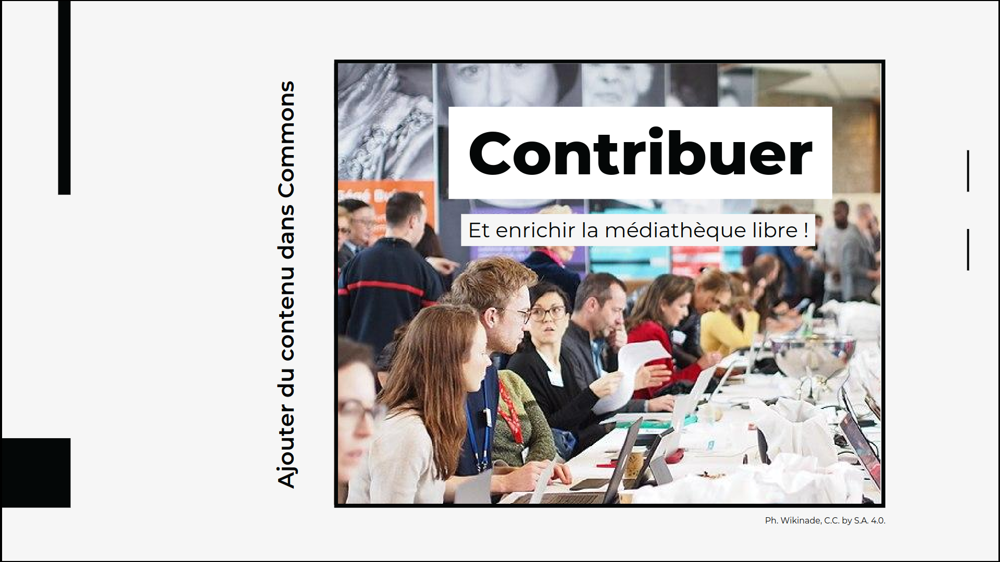

<!-- Scoped style -- >

Communs Numériques Ouverts

<h1>La médiathèque Commons</h1>

<a class="link" href=https://fr.wikipédia.org/wiki/User:Hugo_en_résidence>Hugo Lopez - Wikimédien en résidence</a>.
 BMT, 2023.12.21

---
<!-- Scoped style -->

|   |  |
|---|---|
| <small>Communs Numériques Ouverts</small> | |
| <h1>Wikipédia, Commons, Licences pour Exploreurs</h1> |  
| <small><a class="link" href=https://fr.wikipédia.org/wiki/User:Hugo_en_résidence>Hugo Lopez - Wikimédien en résidence</a>. Exploreur</small>

---
### Hugo Lopez
- 2004 Wikipédien 
- 2005 Commoniste (administrateur)
- 2016 Open education resources
- 2023 Wikimédien en résidence

---
### Plan
- Éditer Wikipédia
- Médiathèque Wikimédia Commons
- Téléverser sur Commons
- Usage des Licences

---
### Objectifs
<!-- 09:35 : SLIDE 44 -->
En fin d'atelier, le participant :
- éditer Wikipédia avec l'éditeur visuel
- saura téléverser une/des images sur Commons
- aura revue l'usage des licences

---
<!-- 11:00 -->
# Éditer Wikipédia
<!--
 
-->

---
<!-- 11:00 Barre Editeur visuel -->

---
# Médiathèque Wikimedia Commons

<!-- Sources -->
| Source libre |  Licence | Auteur
|:----|:----|:---
[Contribuer à Wikimédia Commons - 1h](https://upload.wikimedia.org/wikipedia/commons/0/01/2023-06-16_Formation_Wikimedia_Commons_1_heure.pdf) | CC-BY-SA-3.0 | Wikimédia France

---
<!-- Introduction -- >

---
<!-- Plan -- >

---
<!--Histoire  -->

---
<!-- Chiffres -->

---
<!-- Quoi -->

---
<!-- Comment Commons fonctionne ? 
-->
# 2. Comment fonctionne Commons ? 

---
<!-- A quoi sert Commons ? -->

---
<!-- Role et positionement -->

---
<!-- Mission : libre réutilisation -->

---
<!-- Admins -->

---
<!-- Robots-->

---
<!-- Licences :  principe -->

---
### Licences libres
<!-- Licence libre : échèle -->

---

- [Choisir votre licence](https://chooser-beta.creativecommons.org/) pour vos contenus
- Google: creativecommons.org "choose"

(15 mins)

---
<!-- Contribuer
 -->
# Contribuer

---
<!-- Créer un compte -->

---
# Téléverser un fichier

---
<!-- Importer son 1er fichier  -->

---
<!-- Vérifier -->

---
<!-- Choisir sa licence -->

---
<!-- Vérifications -->

---
<!-- Catégories -->

---
<!-- Données structurées -->

---
# 5. Téléversements de vos images
Il existe des approches **manuelles** et **semi-automatiques** pour téléverser des ressources sur Commons.

---
### 1. À la main
<small>
<table style="margin-left:0;">
<tr>
<td>

Osez la simplicité !
- [Téléverser sur Commons](https://commons.wikimedia.org/wiki/Special:Upload)
- Éditer une image, catégoriser ?
- On y va avec [Bing Image creator](https://www.bing.com/images/create/a-benevolent-young-red-dragon-resting-upon-a-rich-/1-657e40f8c39140d7b41fc122e81e1f62?id=DW245o%2Fa8BLmFSUQQBG0AA.aAfrzYFcu5BK%2Fbf3pBZB6w&view=detailv2&idpp=genimg&form=GCRIDP)

</td><td>

 

</td>
</tr>
</table>
(30mins, 2+ images)
</small>

---
### Bing image creator

---
### 2. Pattypan : démonstration

1. [Installer Pattypan](https://commons.wikimedia.org/wiki/Commons:Pattypan/fr#Liens)
2. Générer un tableau
3. Editer le tableau
4. Charger le tableau
5. Téléverser mes fichiers

---
### 3. Bots
<small>

| [PyWikiBot](https://www.mediawiki.org/wiki/Manual:Pywikibot/Wikidata) | [WikiapiJS](https://kanasimi.github.io/wikiapi/) | [WikidataR](https://cran.r-project.org/web/packages/WikidataR/WikidataR.pdf)
|:--- |--- |---
| Python | Javascript | R 
|   |  | 

Voir aussi [Manual:Creating a bot](https://www.mediawiki.org/wiki/Manual:Creating_a_bot#JavaScript_(Node.js)) et [Commons:Bots/Requests](https://commons.wikimedia.org/wiki/Commons:Bots/Requests).
</small>

---
# 6. Allons plus loin

---
### Modèles
- [{{Gallica}}](https://commons.wikimedia.org/wiki/Template:Gallica)
- [{{WikiVoc}}](https://commons.wikimedia.org/wiki/Template:WikiVoc)

Créer un modèle pour mon institution ? 
C'est possible !

---
### La communauté
- Des forums
- Des pages d'aides
- Des ateliers graphiques
- Des innovations spontanées, frugales, participatives :
  - WikiShootMe
  - Lingualibre

---
### Commons et les IA-artistiques ?
- Discussion en cours
- Usages non-factuels
- De nouveaux assistants graphiques ?
  - retouches massives
  - colorisations
  - "faire sens" ?

...à surveiller.

---
<!-- Scoped style -->

## Restons en contact
| Institution | Wikimédien en résidence | Specialité
|:---- |:---- |:---|
| URFIST Occitanie | <a href="https://fr.wikipedia.org/wiki/user_talk:Hugo_en_résidence">User:Hugo en résidence</a> hugo.lopez@univ-toulouse.fr | Dev web, langues
| URFIST Rennes | <a href="https://fr.wikipedia.org/wiki/user_talk:Juliette_en_résidence">User:Juliette en résidence</a> | Bibliothèques
| URFIST Bordeaux | <a href="https://fr.wikipedia.org/wiki/user_talk:Pyb_en_résidence">User:Pyb en résidence</a> | Com et réseau WP
| Musée de Bretagne | <a href="https://fr.wikipedia.org/wiki/user_talk:VIGNERON_en_résidence">User:VIGNERON en résidence</a> | Wikidata

Formateurs aux communs numériques ouverts. Contactez nous : )

---
## Restons en contact

[Projet:Wikifier la science/Infolettre](https://fr.wikipedia.org/wiki/Projet:Wikifier_la_science/Infolettre)

---
#### Remerciements

Tous les contenus textuels sont sous licence libre.
Crédit: Hugo Lopez, Amélie Charles, Pierre-Yves Beaudouin CC-BY-SA 4.0.
Les illustrations sont la propriété de leurs auteurs respectifs.

---

<!-- Sources -->
### Sources

| File  |  Licence | Author |
|:----|:----|:---|
[Wikipedia logo](https://commons.wikimedia.org/wiki/File:Wikipedia-logo-v2.svg) | CC-BY-SA-3.0 | Wikimedia Foundation
[Commons logo](https://commons.wikimedia.org/wiki/File:Commons-logo.svg) | CC-BY-SA-3.0 | Reidab, Grunt, 3247, Pumbaa
[Pattypan logo](https://commons.wikimedia.org/wiki/File:Pattypan.svg) | CC-BY-SA-4.0 | Rickterto
[Pywikibot logo](https://commons.wikimedia.org/wiki/File:Pywikibot_MW_gear_icon.svg) | PD |	Watchduck
[WikiapiJS logo](https://commons.wikimedia.org/wiki/File:WikiapiJS_MW_gear_icon.svg) | PD | Yug
[R logo](https://commons.wikimedia.org/wiki/File:R_logo.svg) | CC-BY-SA-4.0 | Yug
[Dokumentator*in.png (Pierre-Yves)](https://commons.wikimedia.org/wiki/File:Dokumentator*in.png) | CC-BY-SA-4.0 | Mathis Eckelmann
[Wikimedia_Autor%2Ain.png (Juliette)](https://commons.wikimedia.org/wiki/File:Wikimedia_Autor%2Ain.png) | CC-BY-SA-4.0 | Mathis Eckelmann
[Wikimedia Datensammler*in.png (Hugo)](https://commons.wikimedia.org/wiki/File:Wikimedia_Datensammler*in.png) | CC-BY-SA-4.0 | Mathis Eckelmann
