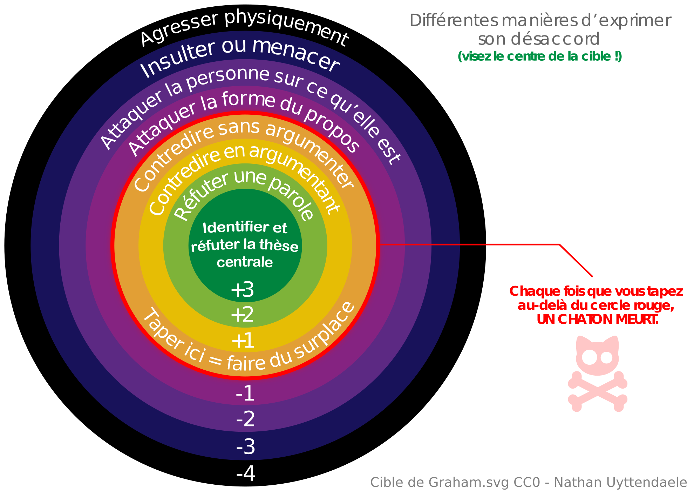

<!-- Scoped style -->

|   |   |
|---|---|
| <small>Communs Numériques Ouverts</small> <h1>Organiser et animer une formation Wiki</h1>|  

<small><a class="link" href=https://fr.wikipédia.org/wiki/User:Hugo_en_résidence>Hugo Lopez - Wikimédien en résidence</a>. 2024.01.11</small>

---
### Hugo Lopez
- 2004 Wikipédien, ex-administrateur
- 2016 Open education resources
- 2023 Wikimédien en résidence

---
 

---

---
### Plan
1. Notre role
2. Définir le projet
3. Contribuer à Commons
4. Activités : préparer un atelier
5. Activités : chercher la réponse
6. Allons plus loin

---
### Objectifs
<!-- 09:35 : SLIDE 44 -->
En fin d'atelier, le participant :
- Aura une vu d'ensemble des étapes préparatives
- Connaitra des points de resources utiles
- Connaitra quelques pièges cachés à éviter
- Ébauchera un plan d'atelier wiki dans son institution
- Saura réagir à l'imprévu de ces ateliers (questions, etc.)

---
#### Tour de table
- Nom, institution, rôle
- Intérêt pour Communs Numériques Ouverts ?

---
#### Vos usages
<!-- 10:00 : Quantitatif -->
- A) Avez-vous édité Wikipédia ?
- B) Avez-vous consulté des pages de discussion ?
- C) Avez-vous co-organisé des ateliers wiki ?

---
## Définition

> Un **atelier contributif à Wikipédia** est temps réservé, dans un lieu donné et en groupe, à la contribution sur **Wikipédia** ou à sa découverte. Les ateliers sont généralement tenus sur 3 à 4h, dans des institutions publiques. Des variations thématiques ou sur des **projets contributifs** proches existent.

---
## Pourquoi ?
- Première source de connaissance pour les usagers
- Un modèle d'internet positif
- Un lieu de citoyenneté raisonnée

**Connaissance organisée et pérène**.

---
<!-- En chiffres -->

---
<!-- Debatre -->

### Cible de Graham

Wikipédia: pour une argumentation collaborative et constructive, centrée sur les [sources fiables](https://fr.wikipedia.org/wiki/Wikipédia:Sources_fiables).

**Légitimité par la source**.

<!--
---
<!-- :00 -- >
Savoir interagir avec la communauté sur Wikipédia
• En cas de doute, chercher de l'aide, apprendre > Citer les lieux d'aide aux nouveaux.
• Cartographier lieux de discussion > Citer les lieux de discussion
• Cartographier les types d'interlocuteurs > Analyser l'historique ? Bestiaire ?
• Cartographier les roles (logiciels) sur Wikipédia > Citer les aidants et connaissants
<!-- -->

---

### Savoirs et confiance

| | | | |
|---|---|---|---|
|  |  | | 

---
## Pourquoi organiser un atelier Wikipédia
- Pourquoi mener un atelier ?
- Pour qui ?

---
## Types d'ateliers

---
#### Atelier formatifs : initier à Wikipédia
- Public: novice-curieur
- Programme : 
   1. présenter LE commun numérique Wikipédia
   2. accompagner l'écriture participative

---
Des profils, durées, et motivations variées impliquent des stratégies différentes :
- Stratégie basse: [modifier] une tournure.
- Stratégie mediane: ajouter une source de qualité.
- Stratégie haute: créer un compte, éditer le brouillon

---

#### Atelier contributif : ajouter du contenu
- Public : initié, déjà acquis
- Programme : 
   - théorique réduit
   - fournir des sources
   - allonger la pratique (3~4h)

---
#### Autres projets
Enregistrements des voix et accents du monde :

| Atikamekw | [Surui d'Amazonie](https://meta.wikimedia.org/wiki/LinguaLibre/Atelier_de_formation_%C3%A0_LinguaLibre_pour_le_Surui/en) | [Occitan sifflé](https://urfist.univ-toulouse.fr/actualite/2023-12-19/loccitan-siffle-enregistre-pour-la-premiere-fois-en-open-access)
|---|---|---|
|  |  | 

---
# Réorganiser les phases

Un jeu de 18 cartes sont disponibles.
- Mélangez
- Réorganiser dans l'ordre chronologique
- Discutez et annotez les cartes

---
# Pause 11h.

---
# Déroulé commenté

---
### Définir les objectifs

> Depuis 2016, la campagne #1Lib1Ref (« One Librarian, One Reference », en français « Un bibliothécaire, une référence ») invite les professionnels de l'information (bibliothécaires, archivistes, professionnel.le.s de l'IST...) à **ajouter des références manquantes dans Wikipédia**, idéalement dans les articles de leur choix. L’opération #1Lib1Ref est un moyen ludique et peu chronophage de découvrir le fonctionnement de Wikipédia et de diffuser des ressources scientifiques.

---
#### L'objectif pédagogique
- **Formatif** vs **contributif**
- point de vue du participant
- comportement ou résultat observable : activité, une procédure, action mentale
- réaliste dans le cadre imparti
- concis
- contextualisé : chemin nécessaire

---
### Programme (format)
Quelles ressources disponibles :
- matérielles
- temps d'atelier
- temps de préparation
- resources cognitives avant / pendant
- quel public ?

Guide le choix pour le temps, déroulement

---
#### Plan officiel
| | |
|:---|:---|
| 20mn | Ouverture: présentation, accés aux sources
| 2h+ | Éditons Wikipédia
| 10mn | (Pause)
| 10mn| Wikipédia & co : des pratiques propres
| 5mn | Pour aller plus loin : pointeurs d'autonomie

---
### Contacter des co-animateurs
La communauté locale ou des collègues.
[[WP:Le Bistro]], [[WP:Rencontres]], etc.

---
### Réserver le site
Confirmer que le matériel est adapté.

---
### Confirmation
Le format de l'évènement est arrêté et confirmé aux co-organisateurs.

---
<small>

| | |
|:--- |:---|
| Durée | 3h
| Sujet | Initiation à Wikipédia - 1lib1ref
| Objectif | ...
| Participants | Bibliothécaires de Toulouse (~10)
| Date | 2024.01.16, 14h - 17h
| Lieu | Bibliothèque de l'Arsenal > sous sol > BU 028
| Contact | Brigitte Jolly <Brigitte.Jolly@ut-capitole.fr>, Chargée de la formation professionnelle > 05.34.45.61.56
| Formateur | Hugo LOPEZ <hugo.lopez@univ-toulouse.fr>, Formateurs aux communs numériques> 06.76.13.02.53

</small>

---
### Affiche papier / Mailling
 
   

Des modèle libres ! 

---
#### Activité
**Situation :** vous organisez un atelier "Culture de la violette" dans votre bibliothèque. Vous souhaiter créer une affiche et vous n'avez pas de service com. 
- Que faire ?
- Quelles informations ?
- Quelle composition visuelle ?

---
### Propositions
| Google image | Commons |
|---|---|
|  | 
| [Affiches atelier wikipédia](https://www.google.com/search?q=commons.wikimedia.org+Affiche+Atelier+wikipedia&tbm=isch) | [Affiches LSP](https://commons.wikimedia.org/wiki/Category:Les_sans_pagEs/Affiches)

--- 

# Recherche documentaire
- Ajout de valeur ajoutée à l'atelier thématique
- Met l'atelier sur des rails.
- S'appuyer sur vos collections.

---
### Email J-2
Relancer, création de compte si n>6.

**Attention:** Création de compte limitée à 6 par jour et par wifi !

**Solution:** anticiper, passer par la 3G, etc.

---
### Boissons et snacks ?

---
### Installation matérielle
Il y a toujours des inprévus !

---
### Accueil
- Café
- Contacts individuels
- Quelques informations sur les profils
- Faire lien

---
### Ouverture d'atelier
Prise de parole :
- Pourquoi : découvrir ce commun numérique participatif.
- Comment: ensemble, via l'édition accompagnée
- Brises glaces

---
### Introduction théorique
- Pour certains ateliers

---
### Modifier Wikipédia
- Fournir des sources
- Osez !
- Circuler dans les rangs.

---
### Pointeurs d'autonomie
La communauté
- Les forums
- Les pages d'aides
- Les ateliers graphiques
- Les innovations spontanées, frugales, participatives

---

### Bienvenue à vous !
Les liens clefs sont sur [nos PdD](https://fr.wikipedia.org/wiki/Special:Login)
- [Forum des nouveaux](https://fr.wikipedia.org/wiki/Wikipédia:Forum_des_nouveaux) - WP:FDN
- [Wikipédia en bref](https://fr.wikipedia.org/wiki/Aide:Wikipédia_en_bref) - WP:BREF
- [5 Principes fondateurs](https://fr.wikipedia.org/wiki/Wikipédia:Principes_fondateurs) - WP:5P
- [Citer ses sources](https://fr.wikipedia.org/wiki/Aide:Citer_ses_sources) - WP:SOURCES
- [Règles de Wikipédia](https://fr.wikipedia.org/wiki/WP:REG) - WP:REG
- [Notoriété d'un sujet](https://fr.wikipedia.org/wiki/Wikipédia:Notoriété) - WP:N
- [Esprit de non violence](https://fr.wikipedia.org/wiki/Wikipédia:Esprit_de_non_violence) - WP:NV

---
### Réaffirmer les acquis
- Barre d'édition : **simple**
- **Légitimité par la source**
- Participatif, **co-édition**
- Un commun numérique, gratuit et **pérenne**

Objectif: maintenir l'engagement de notre communauté locale.

---
### Pointeurs vers la communauté locale ?

**Activité:** [WP:Rencontres](https://fr.wikipedia.org/wiki/WP:Rencontres) , [WP:Le Bistro](https://fr.wikipedia.org/wiki/WP:LB)

Présence sur Toulouse d'une communauté active !

---
### Reporting

---
# Concevoir des ateliers Wikis

Phase pratique, par groupes.

---
### Atelier thématique avec les usagers
**Situation:** Vous sentez chez vos usagers des questionnements sur la construction des savoirs, ainsi qu'une curiosité générale envers Wikipédia. Vous souhaitez tester l'organisation d'un atelier participatifs, en s'appuyant sur Wikipédia.

---
#### Mise en place projet
1. Quel est votre objectif (personnel, institutionel) ?
2. Quelle communication pour réunir au moins 4 participants ?
3. Quelle modalité d'inscription ?
4. Quel thème proposeriez vous ?
5. Quelle durée d'atelier ? Quel déroulement ?

---
#### Jour J-2 à Jour J
1. Quelle préparatifs la dernière semaine ? 
la dernière heure ?
2. Quel déroulement de l'atelier ?
3. Combien d'aidants ?
* Combien de participants ?

---
### Programme : Atelier à sujet libre
- Préparation :
- Public: 
- Objectifs :
- Programme :

---
### Programme : Atelier à sujet libre
- Préparation : pas de documentation à préparer
- Public: confirmé, tant en recherche qu'en wiki
- Objectifs : ajouter du contenu
- Programme : Petit café et on se lance !

---
### Atelier Les Sans Pages
- Préparation : recherche documentaire
- Public: ouvert
- Objectifs : formatif, contributif
- Programme : type contributif.

---
## Édition avancée
- Insertion d'image
- Insertion de tableau
- Insertion de modèle / infobox

---
### Modèles

- [{{Ping}}](https://fr.wikipedia.org/wiki/Modèle:Ping)
- [{{Bienvenue}}](https://fr.wikipedia.org/wiki/Modèle:)
- [OCIM](https://fr.wikipedia.org/wiki/OCIM)

---
# Aider le débutant, trouver de l'aide
Le wikinoob trouvera toujours des pièges inédits pour y tomber. Le mentor n'a pas réponse à tout, mais il sait où chercher.

---
### « La boîte là à droite ! »

**Situation :** Le participant vous demande comment réutiliser un élément avancé (infobox, modèle) d'un article à un autre.
Que faire ?
* Voir [Médiathèque José-Cabanis](https://fr.wikipedia.org/wiki/Médiathèque_José-Cabanis)

--- 
### « Mon tableau est cassé ! »
**Situation :** à force de modification, le débutant à cassé son tableau !
Que faire ? 

---
## [[WP:Jargon]]
[WP:Jargon](https://fr.wikipedia.org/wiki/WP:Jargon)

---
### « Peut tu faire une AaC ? »
**Situation:** Le débutant recoit sur sa PdD le message suivant :

Que faire ?

---
### Introduction à Wikipédia
| [Présentation existantes](https://commons.wikimedia.org/wiki/Category:Presentations_supported_by_Wikimedia_France) | Exemple 
|---- | --- |
|  | 

---
<!-- Scoped style -->

## Restons en contact
| Institution | Wikimédien en résidence | Specialité
|:---- |:---- |:---|
| URFIST Occitanie | <a href="https://fr.wikipedia.org/wiki/user_talk:Hugo_en_résidence">User:Hugo en résidence</a>  hugo.lopez@univ-toulouse.fr | Dev web, langues
| Musée de Bretagne | <a href="https://fr.wikipedia.org/wiki/user_talk:VIGNERON_en_résidence">User:VIGNERON en résidence</a> | Wikidata
| URFIST Bretagne+ | <a href="https://fr.wikipedia.org/wiki/user_talk:Juliette_en_résidence">User:Juliette en résidence</a> | Bibliothèques
| URFIST Bordeaux | <a href="https://fr.wikipedia.org/wiki/user_talk:Pyb_en_résidence">User:Pyb en résidence</a> |Com/réseau

Formateurs aux communs numériques ouverts. Contactez nous

---
## Restons en contact

[Projet:Wikifier la science/Infolettre](https://fr.wikipedia.org/wiki/Projet:Wikifier_la_science/Infolettre)

---
#### Remerciements

Tous les contenus textuels sont sous licence libre.
Crédit: Hugo Lopez, Amélie Charles, Pierre-Yves Beaudouin CC-BY-SA 4.0.
Les illustrations sont la propriété de leurs auteurs respectifs.

<!--
---
### 1. À la main
<small>
<table>
<tr>
<td>

Osez la simplicité !
- [Téléverser sur Commons](https://commons.wikimedia.org/wiki/Special:Upload)

</td><td>

 

</td>
</tr>
</table>
(30mins, 2+ images)
</small>

---

 

-->