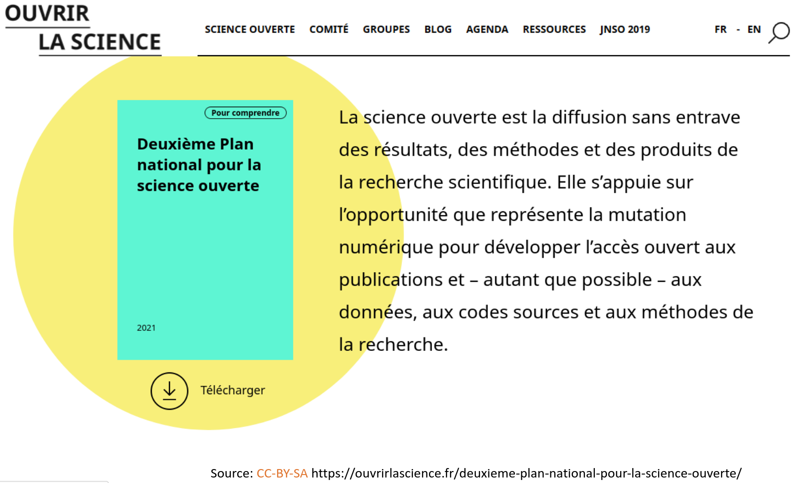
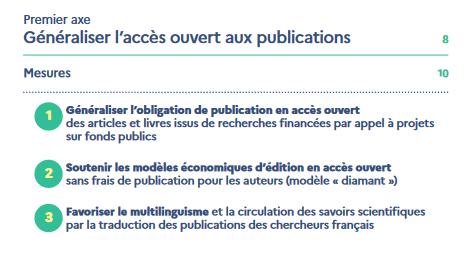
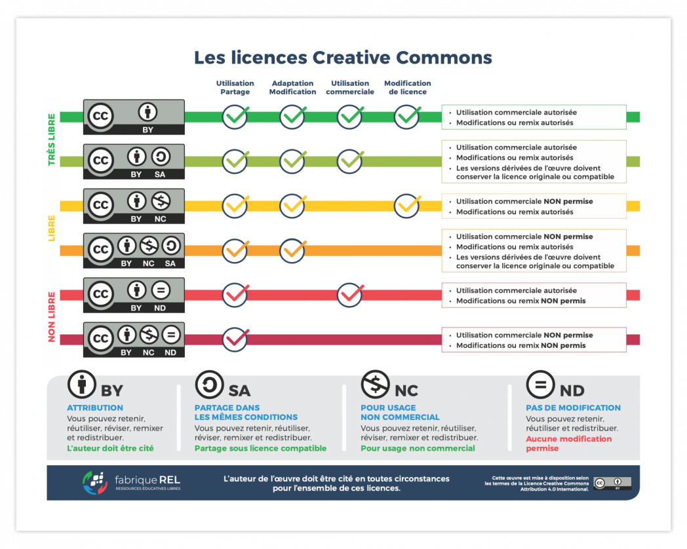

<!-- Scoped style -->

## WIKIDATA & HAL

Présentation, outils et ponts à construire.
<small>
[Hugo Lopez](https://fr.wikipedia.org/wiki/User:Hugo_en_résidence)
Wikimédien en résidence
hugo.lopez@univ-toulouse.fr
</small>

---
# Plan
1. Contexte
2. Introduction à Wikidata
3. Utilisation des données
4. Interroger Wikidata
5. Éditer Wikidata
6. Tableau de bord

---
<small>

### Objectifs
<!-- 09:35 : SLIDE 44 -->
En fin d'atelier, le participant :
- connaitra les concepts clefs de Wikidata
- sera capable d'éditer, corriger manuellement Wikidata
- connaitra 4 approches d'édition sur Wikidata
- saura faire une requête SPARQL "croisée" mon institution + HAL id
- pourra réfléchir à un dashboard croisé HAL + Wikidata
</small>

---
# Contexte de formation
<!-- 09:40 -->
- Formateur : 20 ans de Ressources Éducatives Libres
- Formation : Sciences - Science Ouverte (HAL) - Wikidata
- WER : tour d'horizon, connecter les acteurs.

---

---
<!-- ### Portion d'articles ouvers -->
  

---
<!-- 4 axes science ouverte -->

  
 

---
### Formation récente

Gossa, Godefroid et Beaudouin (2023.06.13:p7-27)
***[Données de la recherche et Wikidata](https://sygefor.reseau-urfist.fr/#/training/10061/12006)*** (en ligne) 
<small>
- Comprendre les enjeux liés au partage et à l’ouverture des données
- Découvrir les bases de Wikidata
- Découvrir les outils de visualisation et d’export de données
- Découvrir des exemples de réutilisations des données de Wikidata
</small>

---
#### Tableau de bord multi-sources

- [TDB des Langues](hugolpz.github.io/LanguagesGallery/)

---
<small>

### Tableau de bord multi-sources
Grace à une jointure via le Qid Wikidata...
- [Wikidata] Language name
- [Wikidata] Number of native speakers worldwide.
- [Lingualibre] Number of contributing speakers.
- [Lingualibre] Gender split.
- [Lingualibre] Unique words vs recordings ratio.
- [Lingualibre] Recordings gender split.
</small>

---
# Découvrons nos usages

---
#### Vos usages
<!-- 10:00 : Quantitatif -->
* A) Combien de fois consultez-vous Wikidata / semaine : 
  <10 ?
  <100 ?
  <1000 ?
* B) Consommez-vous Wikidata ?
* C) Qui a déjà édité ?
* D) Qui a lu une page de discussion
* E) Qui à discuté ?

---
#### Vos représentations
<!-- 10:02 : Qualitatif -->
Fiabilité: sur wikidata, les erreurs et biais sont
- A) fréquents
- B) occasionels
- C) rares

<!-- --- 
10:0: ### Table d'évaluation 

-->

---
<!-- 10:17  -->
# Wikidata
• Quelques éléments fondamentaux. P.Y.Beaudouin (p7-27)

---
<!-- 10:17  -->
# Utilisation des données
• Quelques éléments fondamentaux. P.Y.Beaudouin (p7-27)

---
<!-- Licence libre : échèle -->

---
<!-- 10:25 -->
# Interroger Wikidata
- Utiliser SPARQL pour intéroger Wikidata
- Questionner les éléments HAL

**Ouvrir :**
- Help:SPARQL: [lingualibre.org/wiki/Help:SPARQL_(HAL)](https://lingualibre.org/wiki/Help:SPARQL_(HAL))
- WDQS : https://query.wikidata.org

---
### Propriétés notables : HAL
<small>

| ItemLabel | WD Qid | sur WD | sur HAL |
|:---|---|---|---|
| HAL | Q3144107 | -- | -- |
| HAL author ID | P4450 | 1,816 | 127,272? |
| HAL structure ID | P6773 |5,950 | 35,992 |
| HAL article ID | P7864 | 716 | 1,199,139 |  |
| HAL journal ID | P8903 | 29,733 | 113,000+? |

* Manque de réconciliation

</small>

---

<small>

### Propriétés notables : Articles `P7864`
| ItemLabel | WD Qid |
|:---|:---|
| title | `P1476` |
| author / author name string | `P50` / `P2093` |
| publication date | `P577` |
| published in | `P14233` |
| volume | `P478`|
| issue | `P433`|
| page(s) | `P304` |
| main subject | `P921`

</small>

---
<small>

### Propriétés notables : Revues `P8903`
| ItemLabel | WD Qid |
|:---|:---|
| inception | `P571` 
| title | `P1476`
| main subject | `P921` 
| country of origin | `P495`

</small>

---

<small>

### Propriétés notables : Auteurs `P4450`
| ItemLabel | WD Qid |
|:---|:---|
| sex or gender | `P21`
| date of birth | `P569`
| place of birth | `P19`
| country of citizenship | `P27`
| given name | `P735`
| doctoral advisor | `P184`
| doctoral student | `P185`

</small>

---

<small>

### Propriétés notables : Structures `P6773`
! ItemLabel | WD Qid
|:---|:---|
| inception | `P571` 
| title | `P1476`
| main subject | `P921` 
| country | `P17`
| coordinate location | `P625`
| parent organization | `P749`
| official website | `P856`
| ROR ID | `P6782`

</small>

---
<!-- 10:25 -->
# Éditer Wikidata

---
### 1. À la main
- Osez la simplicité !

---
### 2. User script
- Hacker votre JS, boostez vos contributions !
  - [User:Myname/common.js](https://commons.wikimedia.org/w/index.php?title=User:Yug/common.js&oldid=464920832) 
- [Semi-massive edits](https://commons.wikimedia.org/w/index.php?title=Special:Contributions/Yug&target=Yug&offset=20201001134508&limit=500)

---
### 3. OpenRefine et reconciliation
- Un outil puissant de nettoyage des données
- OpenRefine via votre compte Wikipedia :
https://hub-paws.wmcloud.org
- Reconciliation et export vers Wikidata

---
### Bots
| [PyWikiBot](https://www.mediawiki.org/wiki/Manual:Pywikibot/Wikidata) | [WikiapiJS](https://kanasimi.github.io/wikiapi/)
|:--- |--- |
| Python | Javascript 
|   | 

Voir aussi [:mw:Manual:Creating a bot](https://www.mediawiki.org/wiki/Manual:Creating_a_bot#JavaScript_(Node.js))

---
# Tableau de bord HAL + Wikidata

---
## Questions
Sur vos productions et créateurs de nouveaux savoirs
- Identifier les informations disponibles: WD + HAL
- Identifier les informations interessantes à réunir
- Quelles interfaces ?

---
## Ébauche d'interface

Objectif: imaginer un visuel
- interessant
- lisible
- (engageant)

---
## Ébauche d'interface
Objectif: imaginer un visuel
- interessant
- lisible
- (engageant)

---
# Pour aller plus loin

Métriques par article : [URFIST](https://fr.wikipedia.org/wiki/URFIST)
- [Page statistics](https://xtools.wmcloud.org/articleinfo/fr.wikipedia.org/Unité_régionale_de_formation_à_l'information_scientifique_et_technique)
- [Pageviews](https://pageviews.wmcloud.org/?project=fr.wikipedia.org&platform=all-access&agent=user&redirects=0&range=this-year&pages=Unité_régionale_de_formation_à_l'information_scientifique_et_technique)

Permet d'identifier les éditeurs actifs.

---
<!-- Scoped style -->

## Restons en contact
| Institution | Wikimédien en résidence | Specialité
|:---- |:---- |:---|
| URFIST Occitanie | <a href="https://fr.wikipedia.org/wiki/user_talk:Hugo_en_résidence">User:Hugo en résidence</a>  hugo.lopez@univ-toulouse.fr | Dev web, langues
| Musée de Bretagne | <a href="https://fr.wikipedia.org/wiki/user_talk:VIGNERON_en_résidence">**User:VIGNERON en résidence**</a> | Wikidata
| URFIST Bretagne+ | <a href="https://fr.wikipedia.org/wiki/user_talk:Juliette_en_résidence">User:Juliette en résidence</a> | Bibliothèques
| URFIST Bordeaux | <a href="https://fr.wikipedia.org/wiki/user_talk:Pyb_en_résidence">User:Pyb en résidence</a> |Com/réseau

Formateurs aux communs numériques ouverts. Contactez nous

---
## Restons en contact

[Projet:Wikifier la science/Infolettre](https://fr.wikipedia.org/wiki/Projet:Wikifier_la_science/Infolettre)

---
#### Remerciements

Tous les contenus textuels sont sous licence libre.
Crédit: Hugo Lopez, Amélie Charles, Pierre-Yves Beaudouin CC-BY-SA 4.0.
Les illustrations sont la propriété de leurs auteurs respectifs.

<!-- 15:00 

---
### Todo
- [x] Migrer tableau to wiki
- [x] Contexte
- [x] Close tabs
- [x] Intégrer slides Pyb
- [ ] Verifier salle
- [ ] Imprimer UI design
- [ ] Imprimer taxonomies -->