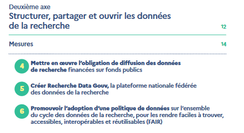
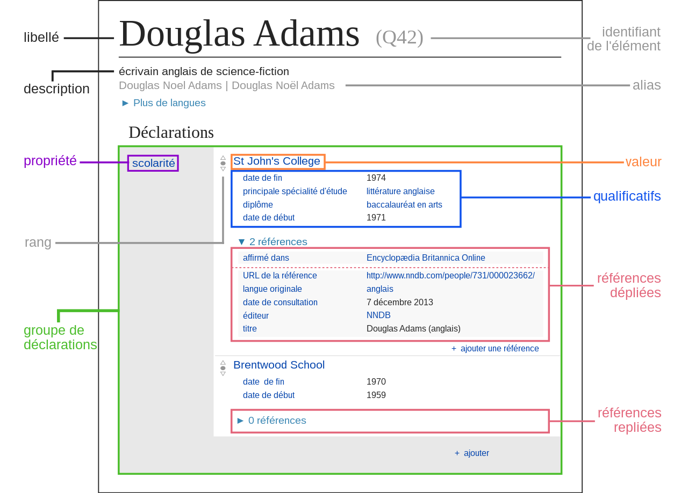
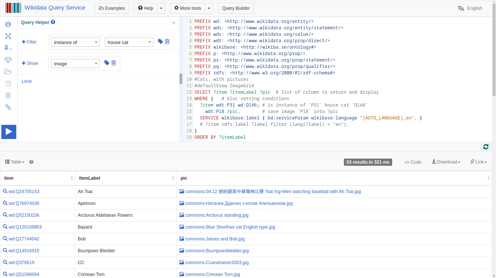
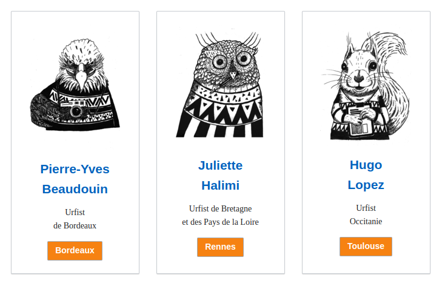

<!-- Scoped style -->

|   |   |
|---|---|
| <small>Communs Numériques Ouverts</small> <h1>Initiation à Wikidata</h1> |  

Présentation, outils et atelier pratique <small><a class="link" href=https://fr.wikipédia.org/wiki/User:Hugo_en_résidence>Hugo Lopez - Wikimédien en résidence</a>. 2023.11.29</small>

---
### Hugo Lopez
- 2004 Wikipédien
- 2012 PhD Chinese elearning, développeur
- 2016 Open education resources
- 2023 Wikimédien en résidence

---
# Plan
1. Contexte
2. Introduction à Wikidata
3. Utilisation des données
4. Interroger Wikidata
5. Éditer Wikidata
6. Tableau de bord

---
<small>

### Objectifs
<!-- 09:35 : SLIDE 44 -->
En fin d'atelier, le participant :
- connaitra les concepts, structures, termes clefs de Wikidata
- sera capable d'éditer, corriger manuellement Wikidata
- connaitre 4 approches d'extraction/édition sur Wikidata
- saura modifier ou faire une requête SPARQL simple
- connaitra les requêtes SPARQL fédérées
- saura ébaucher un tableau de bord croisé
</small>

---
# Contexte de formation

---

---
<!-- ### Portion d'articles ouvers -->
  

---
<!-- 4 axes science ouverte -->

  
 

---

### Is your Linked Open Data 5 Star ?
| | | |
|:---|---|:---| 
| ☆☆☆☆☆ | OA |  Available online (whatever format)'s : Open Access
| ☆☆☆☆<i>★</i> | OL |  Available online, open licence's Open Data (e.g. image scan)
| ☆☆☆<i>★★</i> | RE |  Previous + machine-readable structured data (e.g. excel table)
| ☆☆<i>★★★</i> | OF |  Previous + open format (e.g. CSV)
| ☆<i>★★★★</i> | URI | Previous + open unique identifiers or URLs (URIs) to identify and point to things (e.g. RDF and SPARQL) 
| <i>★★★★★</i> | LD |  Previous + publicly link your data to other open data (e.g. FranceArchive P9371, EOL P830)

---
### Formation récente

Gossa, Godefroid et Beaudouin (2023.06.13:p7-27)
***[Données de la recherche et Wikidata](https://sygefor.reseau-urfist.fr/#/training/10061/12006)*** (en ligne) 
<small>
- Comprendre les enjeux liés au partage et à l’ouverture des données
- Découvrir les bases de Wikidata
- Découvrir les outils de visualisation et d’export de données
- Découvrir des exemples de réutilisations des données de Wikidata
</small>

---
#### Tableau de bord multi-sources

- [Dashboard des langues](hugolpz.github.io/LanguagesGallery/)
- Feed daily by [Sparql2Data](https://github.com/hugolpz/Sparql2Data)

---
<small>

### Tableau de bord multi-sources
Grace à une jointure via le Qid Wikidata...
- [Wikidata] Language name
- [Wikidata] Number of native speakers worldwide.
- [Lingualibre] Number of contributing speakers.
- [Lingualibre] Gender split.
- [Lingualibre] Unique words vs recordings ratio.
- [Lingualibre] Recordings gender split.
</small>

---
# Découvrons vos usages

---
#### Vos usages
<!-- 10:00 : Quantitatif -->
* A) Combien de fois consultez-vous Wikidata / semaine :
  ~1 ?
  <10 ?
  <30 ?
  Plus
* B) Consommez-vous Wikidata ?
* C) Qui a déjà édité ?
* D) Qui a lu une page de discussion

---
#### Vos usages
<!-- 10:00 : Quantitatif -->
Avez vous des connaissances en : 
* A) Bases de données
* B) SQL
* C) GRAPHQL
* D) SPARQL

---
#### Vos représentations
<!-- 10:02 : Qualitatif -->
Fiabilité: sur wikidata, les erreurs et biais sont
- A) fréquents
- B) occasionels
- C) rares

<!-- --- 
10:0: ### Table d'évaluation 

-->

---
<!-- 10:17  -->
# Wikidata
• Quelques éléments fondamentaux. P.Y.Beaudouin (p7-27)

---
<!-- 10:17  -->
# Utilisations des données
• Quelques éléments fondamentaux. P.Y.Beaudouin (p7-27)

---
<small>

### Glossaire Wikidata
| En | Fr |
|:---|:---|
|  | 
<!--
| item | élément
| label | libélé, nom, titre
| statement | déclaration
| propery | propriété 
| reference | sources
| qualifier | qualificateur
-->
- label -> libélé
</small>

---
### Glossaire Wikidata
| En | Fr |
|:---|:---|
|  | 

---
### Créer un élément
Toute personne peut créer un nouvel élément
- [Special:NewItem](https://www.wikidata.org/wiki/Special:NewItem)
- Création libre.
- Critère d'admissibilités
- Admissibilité et suppression à postériori.

----

---
### Créer une propriété

<!--
Toute personne peut créer une propriété
- https://wikidata.org/wiki/Wikidata:Property_proposal/fr
- Discussion et approbation.
- Création par les administrateurs

---
<small>

### Glossaire Wikidata
| En | Fr |
|:---|:---|
| P31 | nature of element is
| P279 | sub-class of

-- >

---
<!-- Licence libre : échèle  -- >
 -->

---
# Utiliser Wikidata
Trois cas d'étude d'enrichissements via Wikidata 
- [LinguaLibre.org](https://lingualibre.org/LanguagesGallery/) : langues collaboratives + Wikidata
- [WikidataESR](https://github.com/cpesr/wikidataESR) : les établissements ESR + leurs relations
- [HAL + Wikidata](https://lingualibre.org/wiki/Help:SPARQL_(HAL)) : étudier la recherche française

---

### LinguaLibre.org : langues collaboratives

| | |
|---|---| 
| <h5>Tableau de bord multi-sources</h3>[Dashboard des langues](hugolpz.github.io/LanguagesGallery/) | 

---

Grace à une jointure via le Qid Wikidata...
- [Wikidata] Language name
- [Wikidata] Number of native speakers worldwide.
- [Lingualibre] Number of contributing speakers.
- [Lingualibre] Gender split.
- [Lingualibre] Unique words vs recordings ratio.
- [Lingualibre] Recordings gender split.

Màj quotidienne via [Sparql2Data](https://github.com/hugolpz/Sparql2Data).

---

### WikidataESR : structurer un domaine
| | |
|:---|---| 
| <small> Synchroniser [DataESR](https://data.esr.gouv.fr/FR/) -le recensement des établissements ESR- leurs pages [Wikidata](https://wikidata.org), en fonction des manquements de propriétés-valeurs, puis création d'une rampe de correction pour favoriser la collecte des données dispersées via de la contribution participatives. <li> https://github.com/cpesr/wikidataESR/</li></small> | 

---
, 

#### Aspects et visualisations

<small>

- [Wikidata] entités et status : établissements, laborattoires, URF
- [Wikidata] histoires : dates, prédécesseurs, successeurs
- [Wikidata] relations fines : filiations
- [Local] [kpiESR](https://github.com/cpesr/kpiESR) : nombres d'étudiants, chercheurs, personnels, finances, etc.
</small>

---

#### Méthode
| Éléments de travail | [Propriétés utiles](https://github.com/cpesr/wikidataESR#propriétés) | [Status](https://github.com/cpesr/wikidataESR#liste-des-statuts-recommandés) | Alertes | Rampes de correction
|---|---|---|---|---|
|  |  |  |  | 
| `Q578023` UT |  `P31` nature   | `Q3918` université | "`P31` manquant" | [@CPESR](https://twitter.com/CPESR_), [Shiny-app](https://data.cpesr.fr/tdbesr/)

----

#### [Tableau de bord](https://cpesr.fr/tableau-de-bord-esr/) : [code](https://github.com/cpesr/tdbESR-rapport#tableaux-de-bord), [pdf](https://github.com/cpesr/tdbESR-rapport/blob/master/tdbesr-rapport.pdf), [web-app](https://data.cpesr.fr/tdbesr/)

---
<!-- 10:25 -->
# Interroger Wikidata
- Utiliser SPARQL pour intéroger Wikidata
- Questionner les éléments HAL

**Ouvrir :**
- WDQS : https://query.wikidata.org
- Help:SPARQL: [Help:SPARQL_(HAL)](https://lingualibre.org/wiki/Help:SPARQL_(HAL))

---
### Propriétés notables : HAL
<small>

| ItemLabel | WD Qid | sur WD | sur HAL |
|:---|---|---|---|
| HAL | Q3144107 | -- | -- |
| HAL author ID | P4450 | 1,816 | 127,272? |
| HAL structure ID | P6773 |5,950 | 35,992 |
| HAL article ID | P7864 | 716 | 1,199,139 |  |
| HAL journal ID | P8903 | 29,733 | 113,000+? |

* Manque de réconciliation

</small>

---

### Propriétés notables : Auteurs `P4450`
| temLabel | WD Qid |
|:---|:---|
| **ORCID** | **`Q51044`**
| sex or gender | `P21`
| date of birth | `P569`
| place of birth | `P19`
| country of citizenship | `P27`
| given name | `P735`
| doctoral advisor | `P184`
| doctoral student | `P185`
</small>

---
# Requêtes

---

### Wikidata Query Service (WDQS)

| | |
|:---|---| 
| Essayez le WDQS: [query.wikidata.org](https://query.wikidata.org) - [Wikidata Query Service/User Manual](https://mediawiki.org/wiki/Wikidata_Query_Service/User_Manual/fr#Les_extensions) - Fetch the cats ! [w.wiki/8Jsx](https://w.wiki/8Jsx) | 

---

### API Sandbox / Bac à sable

| | |
|:---|---| 
| [Essayer l'API via le bac à sable](https://www.wikidata.org/w/api.php?action=wbgetentities&format=json&sites=frwiki&titles=renard&props=descriptions%7Clabels%7Cclaims%7Caliases&languages=en%7Czh%7Cfr%7Ces%7Cja%7Cko%7Csw%7Cta&normalize=1&formatversion=2) - Page [Special:ApiSandbox](https://www.wikidata.org/wiki/Special:ApiSandbox) - Onglet `Main` > choisir l'action - Onglet `action=` > configurer l'action - Onglet `Résultats` : cliquer > `URL requête`: copier **Étudier la requête !** / [Lire l'aide](https://www.mediawiki.org/wiki/Wikibase/API) | 

---

### Requêtes fédérées SPARQL
| | |
|:---|---| 
| Une **requête fedérée SPARQL** tape dans **plusieurs bases** de connaissances via l'url d'entrée de leurs **endpoints** et leurs **prefixes*. Ces bases doivent avoir une **déclaration commune**, permettant une jointure des éléments. - [Liste des endpoints ouvert pouvant être fédérés](https://mediawiki.org/wiki/Wikidata_Query_Service/User_Manual/SPARQL_Federation_endpoints)

---
<!-- 10:25 -->
# Éditer Wikidata

---
### 1. À la main
Osez la simplicité ! [Éditons Wikidata](https://www.wikidata.org/wiki/Wikidata:Tours/fr).
- [Éditer un élément](https://www.wikidata.org/w/index.php?title=Q16943273&tour=wbitems)
- [Éditer une déclaration](https://www.wikidata.org/w/index.php?title=Q17339402&tour=wbstatements)

---
### 2. User script
- Hacker votre JS, boostez vos contributions !
  - [User:Myname/common.js](https://commons.wikimedia.org/w/index.php?title=User:Yug/common.js&oldid=464920832) 
- [Semi-massive edits](https://commons.wikimedia.org/w/index.php?title=Special:Contributions/Yug&target=Yug&offset=20201001134508&limit=500)

---
### 3. OpenRefine et reconciliation
- Un outil puissant de nettoyage des données
- OpenRefine via votre compte Wikipedia :
https://hub-paws.wmcloud.org
- Reconciliation et export vers Wikidata

---
### 4. Bots
| [PyWikiBot](https://www.mediawiki.org/wiki/Manual:Pywikibot/Wikidata) | [WikiapiJS](https://kanasimi.github.io/wikiapi/) | [WikidataR](https://cran.r-project.org/web/packages/WikidataR/WikidataR.pdf)
|:--- |--- |---
| Python | Javascript | R 
|   |  | 

Voir aussi [:mw:Manual:Creating a bot](https://www.mediawiki.org/wiki/Manual:Creating_a_bot#JavaScript_(Node.js))

---
# Tableau de bord HAL + Wikidata

---
## Questions
Sur vos productions et créateurs de nouveaux savoirs
- Identifier les informations disponibles: WD + HAL
- Identifier les informations interessantes à réunir
- Quelles interfaces ?

---
## Ébauche d'interface

Objectif: imaginer un visuel
- interessant
- lisible
- (engageant)

---
## Ébauche d'interface
Objectif: imaginer un visuel
- interessant
- lisible
- (engageant)

<!--
---
# Pour aller plus loin

Métriques par article : [URFIST](https://fr.wikipedia.org/wiki/URFIST)
- [Page statistics](https://xtools.wmcloud.org/articleinfo/fr.wikipedia.org/Unité_régionale_de_formation_à_l'information_scientifique_et_technique)
- [Pageviews](https://pageviews.wmcloud.org/?project=fr.wikipedia.org&platform=all-access&agent=user&redirects=0&range=this-year&pages=Unité_régionale_de_formation_à_l'information_scientifique_et_technique)

Permet d'identifier les éditeurs actifs.
-->

---
<!-- Scoped style -->

## Restons en contact
| Institution | Wikimédien en résidence | Specialité
|:---- |:---- |:---|
| URFIST Occitanie | <a href="https://fr.wikipedia.org/wiki/user_talk:Hugo_en_résidence">User:Hugo en résidence</a>  hugo.lopez@univ-toulouse.fr | Dev web, langues
| Musée de Bretagne | <a href="https://fr.wikipedia.org/wiki/user_talk:VIGNERON_en_résidence">**User:VIGNERON en résidence**</a> | Wikidata
| URFIST Bretagne+ | <a href="https://fr.wikipedia.org/wiki/user_talk:Juliette_en_résidence">User:Juliette en résidence</a> | Bibliothèques
| URFIST Bordeaux | <a href="https://fr.wikipedia.org/wiki/user_talk:Pyb_en_résidence">User:Pyb en résidence</a> |Com/réseau

Formateurs aux communs numériques ouverts. Contactez nous

---
## Restons en contact

[Projet:Wikifier la science/Infolettre](https://fr.wikipedia.org/wiki/Projet:Wikifier_la_science/Infolettre)

---
#### Remerciements

Tous les contenus textuels sont sous licence libre.
Crédit: Hugo Lopez, Amélie Charles, Pierre-Yves Beaudouin CC-BY-SA 4.0.
Les illustrations sont la propriété de leurs auteurs respectifs.

<!-- 15:00 

---
### Todo
- [x] Migrer tableau to wiki
- [x] Contexte
- [x] Close tabs
- [x] Intégrer slides Pyb
- [ ] Verifier salle
- [ ] Imprimer UI design
- [ ] Glossaire à imprimer
- [x] Demo Query Viz
- [x] Demo Sandbox
- [ ] Déplacer glossaire
- [ ] Déplacer Query viz
- [ ] Travailler Open Refine

-->

----

### WDQS (WikiData Query Service)
Galaxies avec images
<iframe title="Démonstration d'ontologie de l'éléphant" src="https://query.wikidata.org/embed.html#%23Brightest%20stars%2C%20with%20image%0A%23defaultView%3AImageGrid%0A%23%20Brightest%20celestial%20bodies%0ASELECT%20%3Fstar%20%3FstarLabel%20%3Fimages%20%3Fapparent_magnitude%0AWHERE%20%7B%0A%20%20SERVICE%20wikibase%3Alabel%20%7B%20bd%3AserviceParam%20wikibase%3Alanguage%20%22en%22.%20%7D%0A%20%20%7B%20SELECT%20%20%3Fstar%20%3Fapparent_magnitude%20%3Fimages%0A%20%20%20%20WHERE%20%7B%20%20%20%0A%20%20%20%20%20%20%3Fstar%20wdt%3AP31%20wd%3AQ523%3B%0A%20%20%20%20%20%20%20%20%20%20%20%20wdt%3AP1215%20%3Fapparent_magnitude%3B%0A%20%20%20%20%20%20%20%20%20%20%20%20wdt%3AP18%20%3Fimages%20.%0A%20%20%20%20%20%20FILTER%28%3Fapparent_magnitude%20%3C%201%29%0A%20%20%20%20%7D%20LIMIT%2010%20%0A%20%20%7D%0A%7D%20ORDER%20BY%20%28%3Fapparent_magnitude%29" referrerpolicy="origin" sandbox="allow-scripts allow-same-origin allow-popups" ></iframe>

----

### Graph Builder
Sub-classe of (P279) elephant (Q7378)
<iframe title="Démonstration d'ontologie de l'éléphant" src="https://angryloki.github.io/wikidata-graph-builder/?property=P279&amp;item=Q7378&amp;lang=fr&amp;mode=reverse" width="950" height="800">
Votre navigateur ne permet pas d'afficher les IFrames.
</iframe>

----

Sub-classe of (P279) cow (Q830)
<iframe title="Démonstration d'ontologie de l'éléphant" src="https://angryloki.github.io/wikidata-graph-builder/?property=P279&amp;item=Q830&amp;lang=fr&amp;mode=reverse" width="950" height="800">
Votre navigateur ne permet pas d'afficher les IFrames.
</iframe>

----

`Parent taxon` (P171) of homo Q171283, hominidaes Q635162 
<iframe title="Démonstration d'ontologie de l'éléphant" src="https://angryloki.github.io/wikidata-graph-builder/?property=P171&amp;item=Q635162&amp;lang=fr&amp;mode=reverse" width="950" height="800">
Votre navigateur ne permet pas d'afficher les IFrames.
</iframe>

